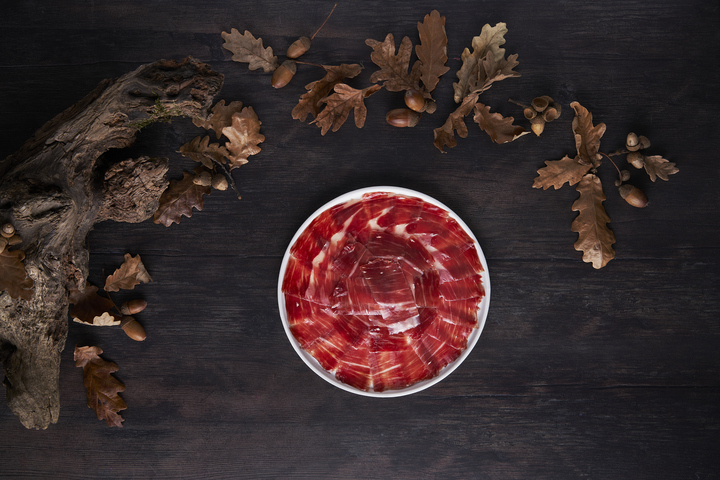

En estos días, comienza la temporada de la carne fresca ibérica de bellota. Este producto limitado y de temporada es el resultado de la alimentación natural de los cerdos en la montanera y la bellota, lo que le da su característico sabor y textura.

## La carne 100% ibérica de bellota

La carne 100% ibérica de bellota es un producto limitado, fresco y de temporada. La mayor calidad y excepcionalidad de la carne de cerdo se consigue en esta época que coincide con la temporada de la bellota y de la montanera. Este tipo de carne es considerado como uno de los alimentos más exquisitos y exclusivos de la gastronomía española y es muy apreciado en todo el mundo.

## Jornadas Gastronómicas del Ibérico Fresco de Bellota

Para celebrar el comienzo de la temporada de la carne fresca ibérica de bellota, Carrasco Ibéricos lanza la 10ª edición de sus Jornadas Gastronómicas del Ibérico Fresco de Bellota. Del 15 de febrero hasta el 31 de marzo, una selección de restaurantes exclusivos participan incluyendo los mejores frescos de Carrasco en sus cartas.

Si eres un amante de los mejores sabores y buscas algo diferente, ahora es la época perfecta para poder ir a degustar los mejores frescos 100% ibéricos de Bellota. Descubre [aquí](https://carrascoibericos.com/donde-comer-carnes-ibericas-carrasco/) todos los restaurantes.

## Recetas de algunos de los restaurantes seleccionados

Para los más cocinillas, también a través de su página web de Carrasco, podrás encontrar recetas de algunos de los restaurantes seleccionados para estas Jornadas y sorprender en casa con platos con un producto exclusivo, jugoso y con mayor sabor.

## Desde Guijuelo directo a casa

Además, Carrasco Ibéricos ofrece la posibilidad de comprar su carne fresca de bellota directamente desde Guijuelo a través de su [página web](https://carrascoibericos.com/tienda/carnes-ibericas/). De esta forma, podrás disfrutar de este producto exclusivo y de alta calidad en tu hogar, y preparar deliciosos platos con la carne fresca de bellota.
