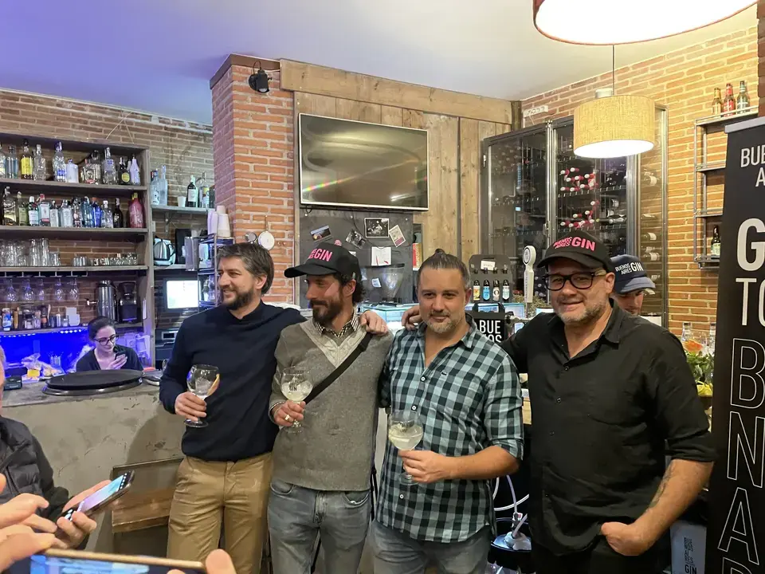
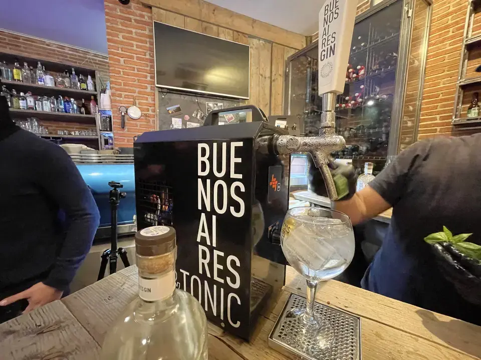
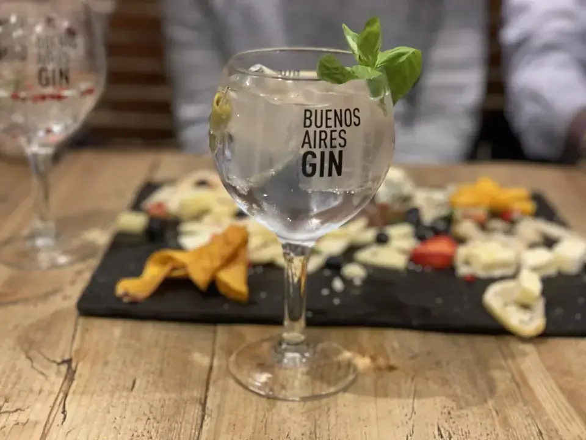

Pues sí, como leeis en el título, ayer probé mi primer (y segundo) Gin Tonic de grifo, con ginebra Argentina London Dry y en este post te quiero contar cómo y por qué.

# Un poco de contexto, ¿Quienes son Buenos Aires Gin?

Buenos Aires Gin nació en Argentina en 2016. Fue fundado por Bruno y Franco Moretti. En aquel entonces, comenzaron a elaborar una Ginebra artesanal al estilo London Dry con cuádruple destilación de 7 botánicos con la que han ganado con dos premios. Por un lado tienen la medalla de bronce de los International Wine and Spirit competition (IWSC) y el Best Contemporary Gin por la World Gin Awards.

# ¿Cómo surge la idea de Gin Tonic de Grifo?

Nos contaban que en 2016, cuando ellos nacen, tenían que competir con la cerveza artesana en Argentina y les costaba mucho vender su Ginebra artesanal. Por ello, se les ocurrió la idea de distribuirla en grifo utilizando las mismas instalaciones que se utilizan para servir la cerveza. Y por instalaciones nos referimos al grifo, a cómo conectar los barriles, a como refrigerarlos ...

Esta idea se les ocurrió en 2019 y comenzaron a buscar si alguien ya lo había hecho coma porque no les parecía lógico que todavía nadie lo estuviese haciendo. Al ver que nadie lo había comercializado hasta el momento, se pusieron manos a la obra y hasta hoy que presentan en España este concepto de Gin tonic barril.

# Y, ¿Que es el Gin Tonic de barril?

En resumen, es la mezcla de su Ginebra London Dry junto con su agua tónica llamada 4.5 bar. Nos contaban que se hace la misma mezcla que en un gin tonic tradicional, es decir, 2 Oz de Ginebra y 200 ml de agua tónica. Y todos salen exactamente igual. Con esto lo que consiguen es un gin tonic muy rico.Pero servido en menos de un minuto. De hecho, su propio récord es de servir cuatro gin tonic por minuto.

Y mientras que mantienen una calidad muy alta.El precio recomendado de este gin tonic no sobrepasaría los €8. Desde hoy ya estará disponible en algunos de los bares y restaurantes más importantes de España. Por ejemplo, ya podéis probarlo en Mamua Madrid. Y se plantean traerlo de cara a primavera, verano a otros 3. Ámbitos muy habituales el de los festivales, el de la discoteca y el de los eventos familiares o con amigos.

El gin tonic que sale tiene unos 9% Alc/Vol, lo mismo que un gin tonic preparado artesanalmente.

Y además nos destacaban que como lo tenían a una temperatura baja, la copa, se mantiene mucho más tiempo a la misma temperatura sin derretir los cubos de hielo. Por lo que de principio a casi el final disfrutas de una copa fría y que no está aguada.

# Con el gin tonic de grifo ganamos en sostenibilidad

Cabe destacar que en Argentina ya lo tienen implementado con barriles de retorno, pero en España, de momento, serán barriles de un solo uso. Aún así, como desde el punto de vista de la ecología y el cuidado por el medio ambiente, coma cuando tengan implementado el servicio de barriles reutilizables por cada barril de 30 L se evitarían 9 botellas de vidrio y 120 latas de aluminio, lo cual ayudaría a ser mucho más ecológicos. Por lo pronto, tendremos el mismo beneficio, pero seguiremos generando residuos con los barriles que no se pueden reutilizar.

Si quereis seguirles por redes para estar al tanto de dónde estará disponible estos "Gintonics de barril" podeis hacerlo en su instagram [@buenosairesgin.es](https://www.instagram.com/buenosairesgin.es/)