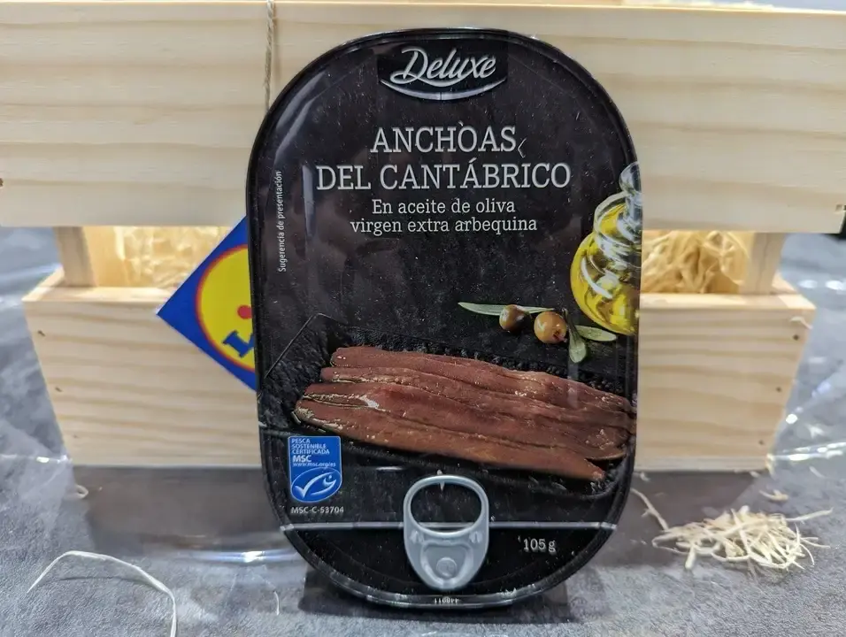
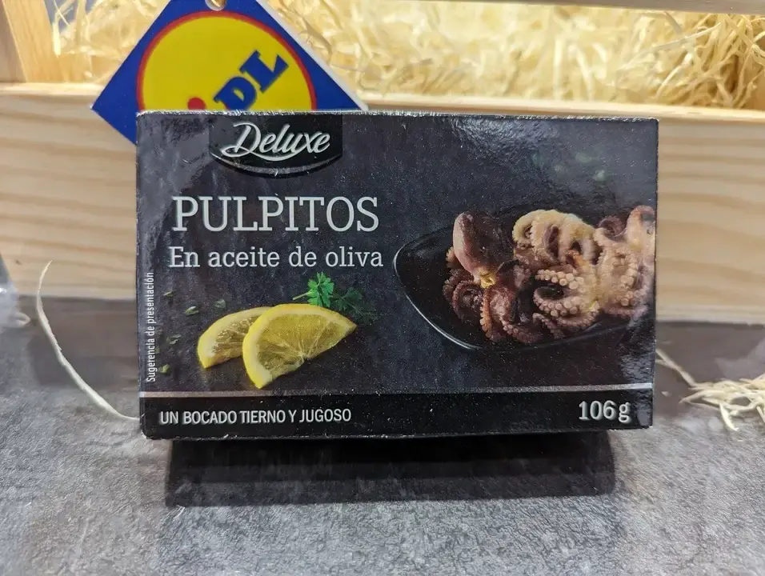
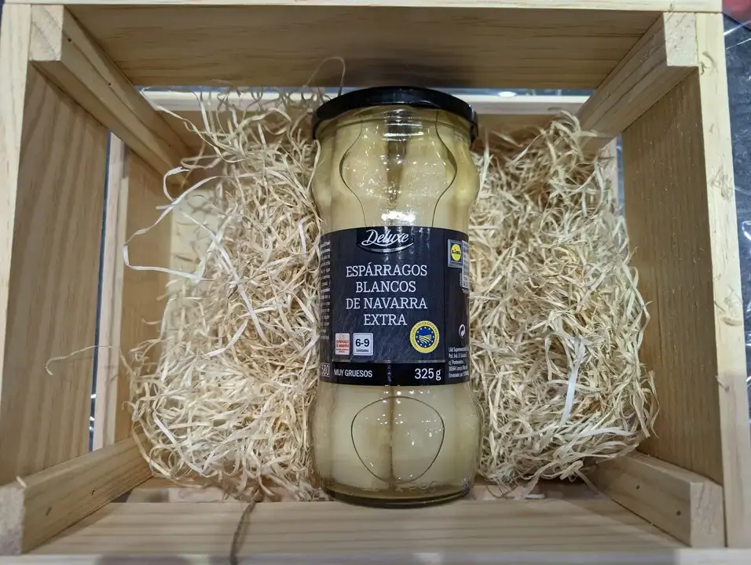
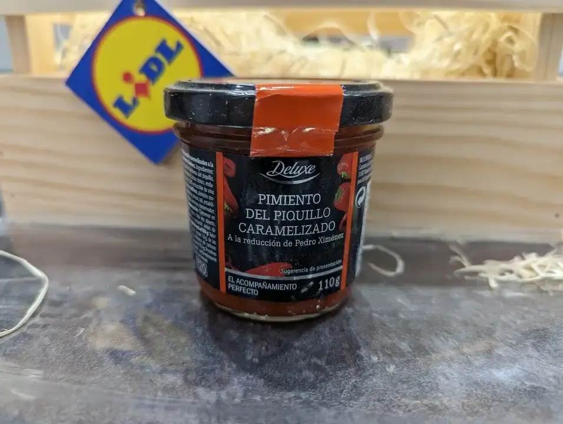
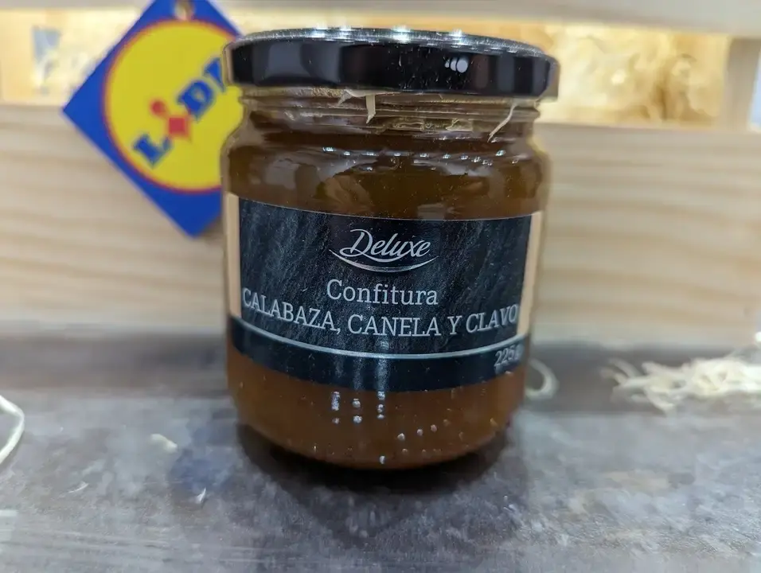
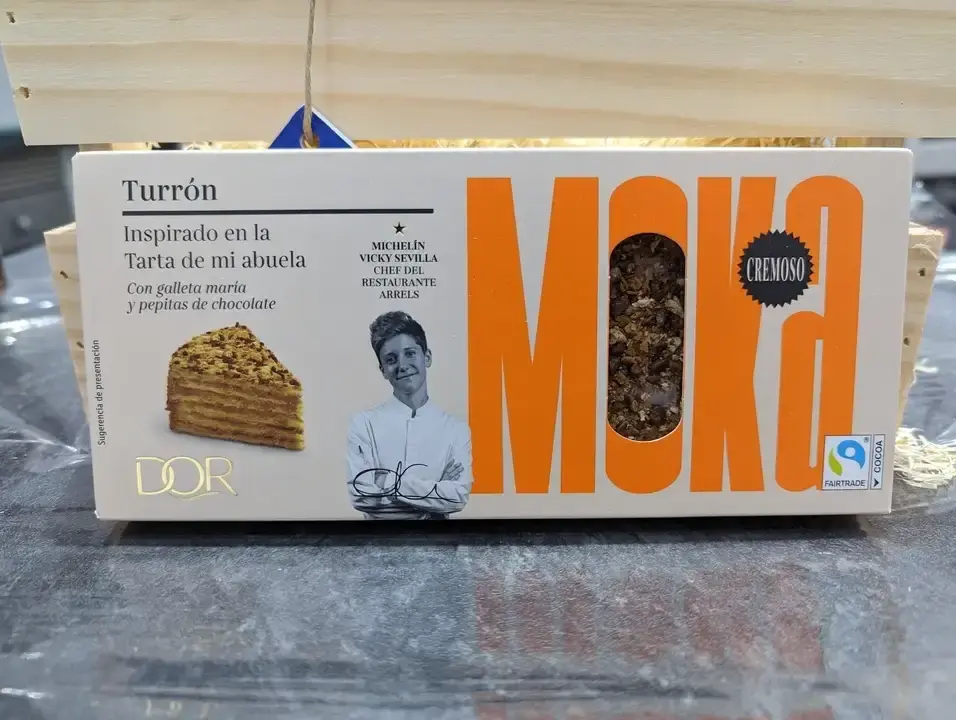

Hace muy pocos días, Lidl presentó su colección de alimentos de navidad y en este post os vengo a enseñar los que nos han mandado para probar. Si os interesa saber cómo de ricos estan, no dejéis de seguirme en instagram, donde cuento todo eso. Por lo pronto, vamos a ver qué cositas nos han mandado.

* Anchoas del cantábrico en aceite de oliva virgen extra de arbequina: Una lata de anchoas con 55 gramos escurridos con muy buena pinta. Su precio, 4,99€

* Pulpitos en aceite de oliva: otra lata de patas de pulpo listas para servir y quedar genial con tus aperitivos. 106 gramos a 3,49€ la lata.

* Espárragos blancos IGP Navarra extra: de 6 a 9 peizas con 325 gramos de peso escurrido. Bien carnosos directos desde Navarra a tu mesa.

* Pimientos del piquillo caramelizado a la reducción de Pedro Ximenéz: ideal para unutar y acompañar con biscotes. 110 gramos de placer al paladar.

* Confitura de Calabaza, Canela y Clavo: 225 gramos de esta mermelada que acompaña perfectamente foie, quesos o pescados. 

* Turrón "Inspirado en la Tarta de mi abuela" de la chef estrella michelín Vicky Sevilla (Restaurante Arrels): En concreto, sabor Moka. a 2,69€ la tableta, ya os adelanto que lo he probado un poquito, y es una delicia.

Y hay muchos más productos, no dejes de darle un vistazo al catálogo de novedades [aquí](https://www.lidl.es/es/navidad/s5970){:rel=“nofollow”}