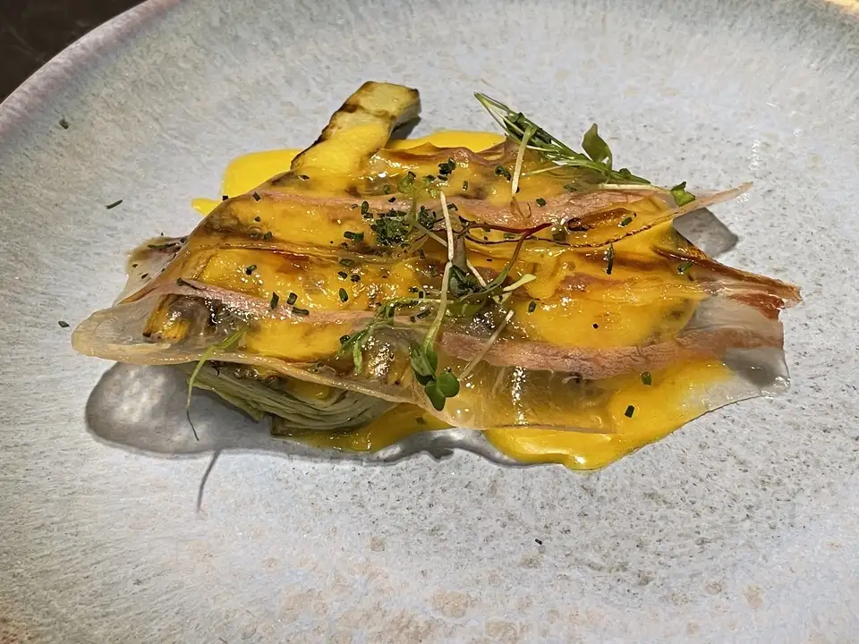
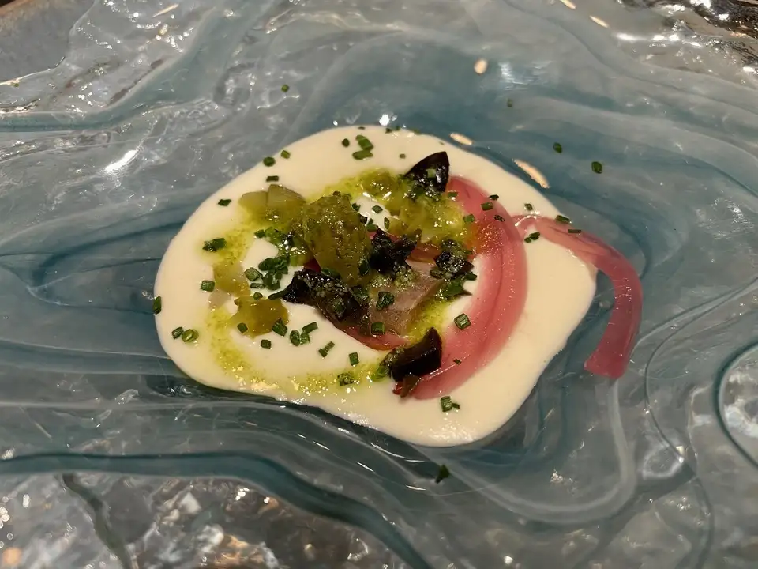
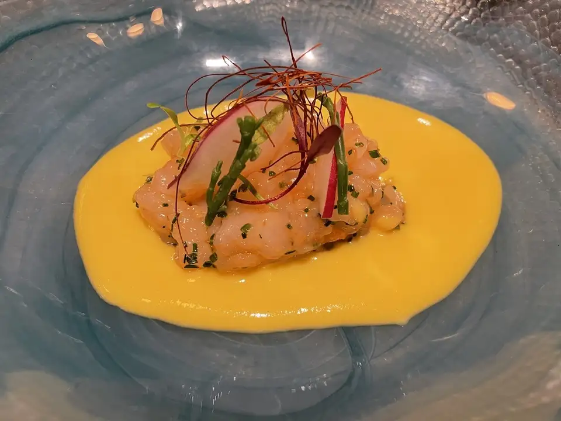
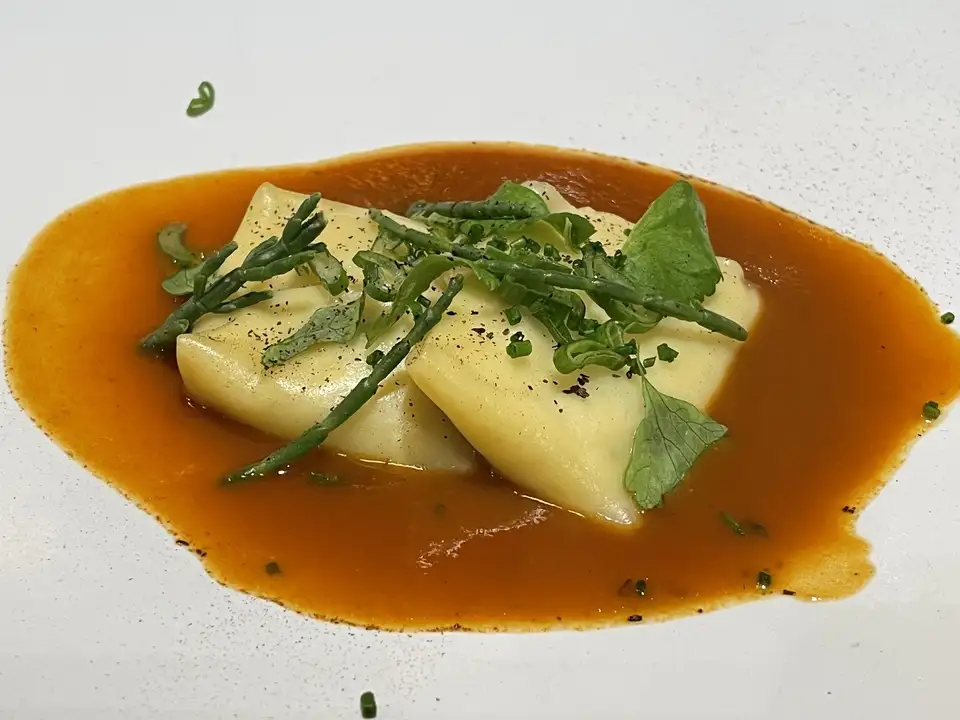
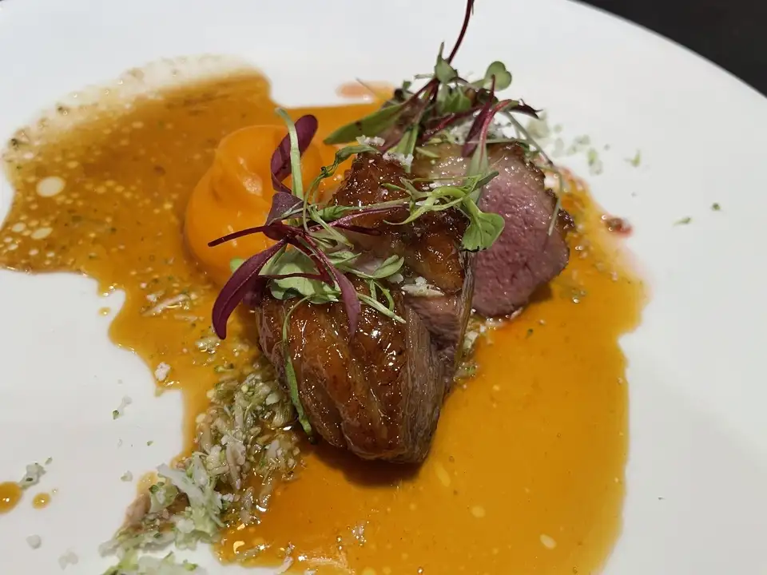
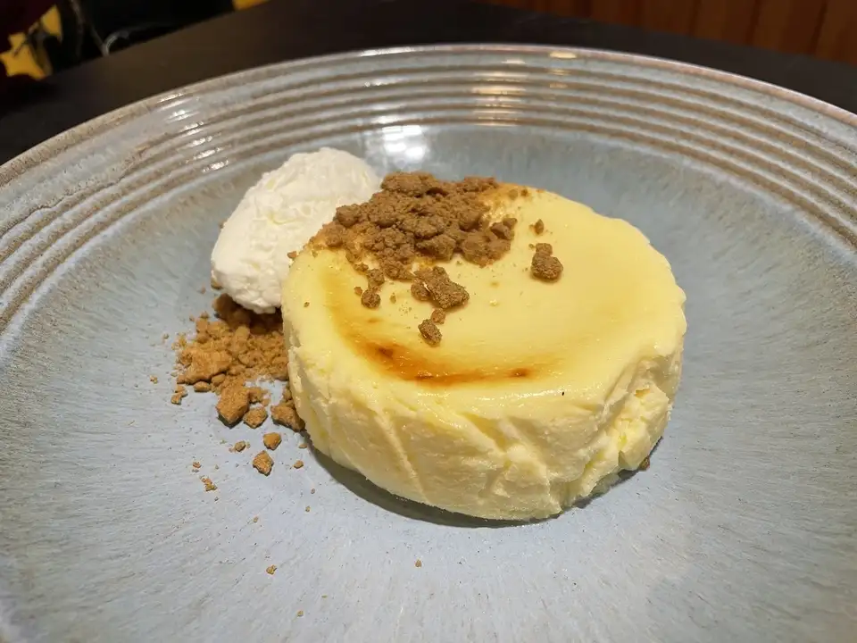
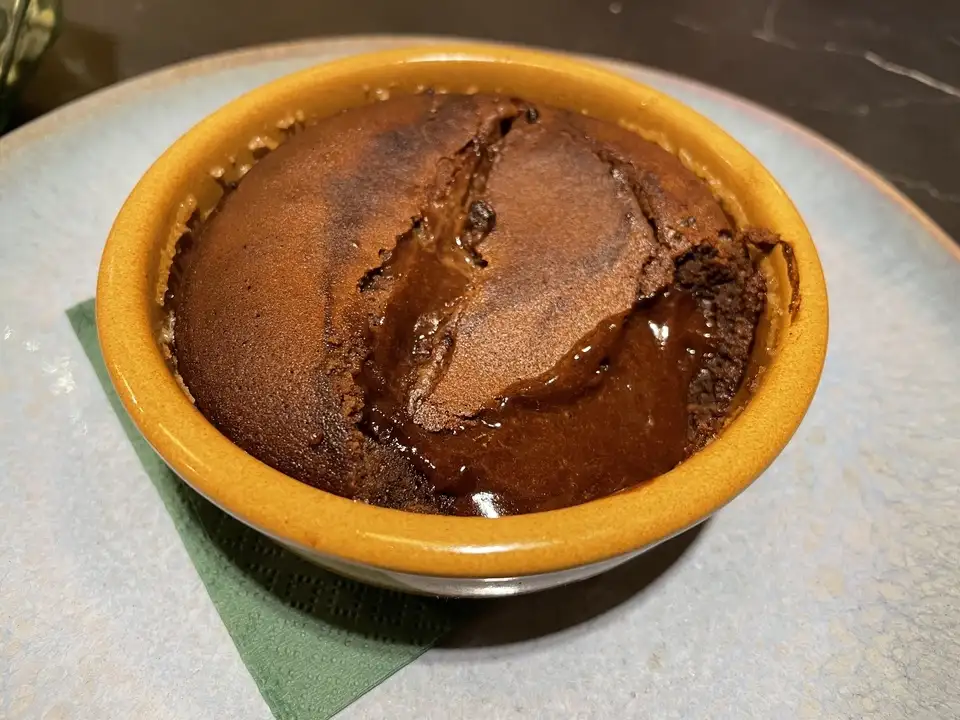

👨‍🍳 Argayo Espacio Gastronómico @argayo_espacio_gastronomico 
📍 C. Rector Lorenzo Morillas Cuevas #motril
💲 Precio: 💲💲💲
⭐️ Valoración: 9.5
✨Como me invitaron ellos, nos pusieron un menú a su elección de platos que incluyó:

- Alcachofa a la parrilla con emulsión de yema y panceta curada: uno de sus platos más vendidos y no me extraña. Una alcachofa muy limpia y tierna, acompañada de emulsión de yema de huevo y una panceta ibérica que daba el toque salado al conjunto.

- Ajoblanco con encurtidos y sardinas: este fue un aperitivo. El ajo blanco muy bueno y el contraste con los encurtidos y la sardina le daban un toque riquísimo.

- Ceviche de quisquilla con salsa de maíz picante: este plato es espectacular. La quisquilla de Motril tiene un sabor en boca muy potente, y junto con la salsa de maíz, en el paladar dejan un sabor inigualable.

- Ravioli de bacalao con salsa chilicrab: aunque el ravioli estaba muy bueno, la gran protagonista de este plato es la salsa. Con deciros que hasta que no se me acabó el pan no dejé de mojar os digo todo.

- Magret de pato con cuscus vegetal y salsa de zanahoria y naranja: el punto del Magret estaba perfecto. La salsa con un potente sabor a cítricos junto con el puré de zanahoria y naranja, haciendo una combinación perfecta en el plato, y en la boca.

Y dos postres a compartir con @comidasdemadrid 

- Tarta de queso con helado de leche merengada: soy bastante fan de las tartas de queso y esta me encantó. Un buen punto de fluidez, la galleta Lotus daba ese punto de dulzor y contraste con la tarta y el helado de leche merengada simplemente completa este conjunto.

- Souffle de chocolate con flambeado de ron (fuera de carta): este postre es una de las posibles propuestas para entrar en carta que tienen en Argayo. Es un souflé de chocolate flambeado con ron de la tierra donde con el interior fluido y el contraste con el sabor a ron dejan en el paladar una sensación increíble para cerrar la cena.

Y para terminar, un café con leche firmado por @cafessolycrema 

Argayo es uno de los sitios donde darte un homenaje cuando veranees por Motril o alrededores. Muy recomendable. Seguro que repito