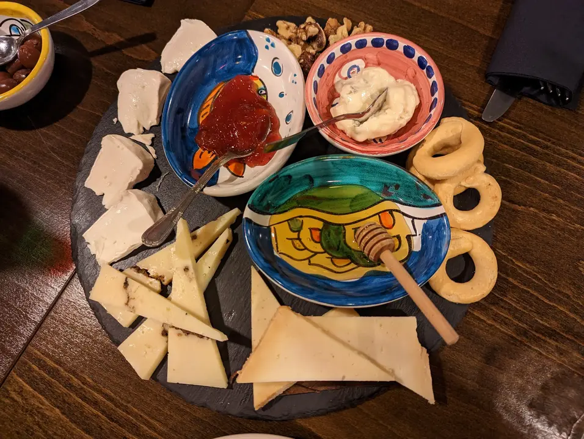
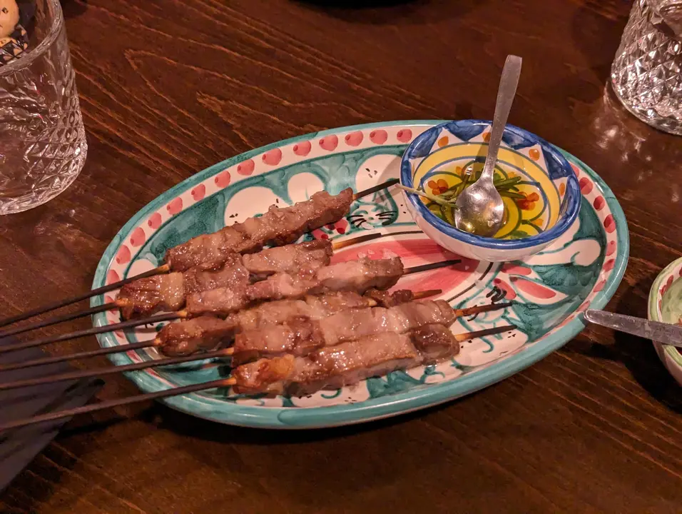
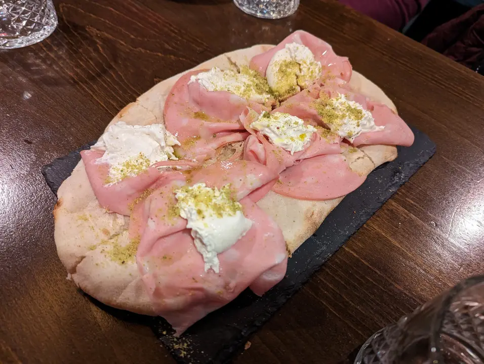
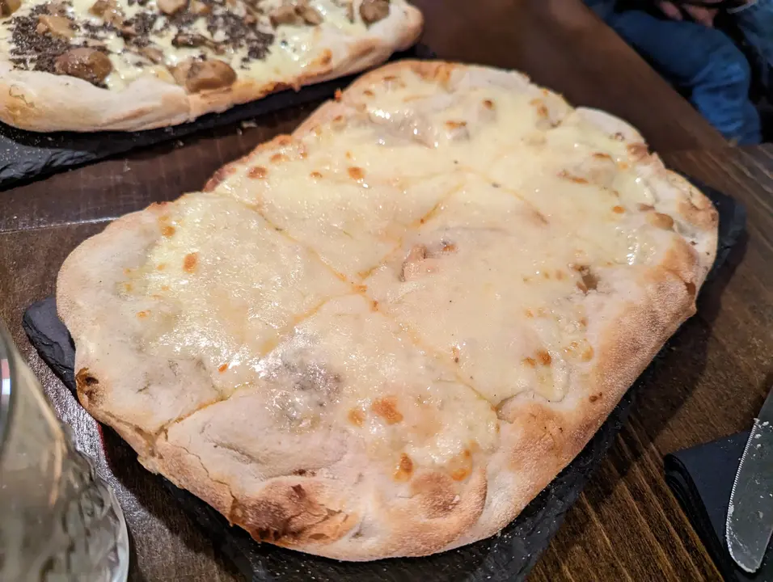
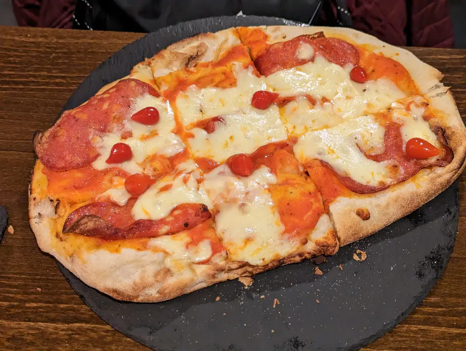
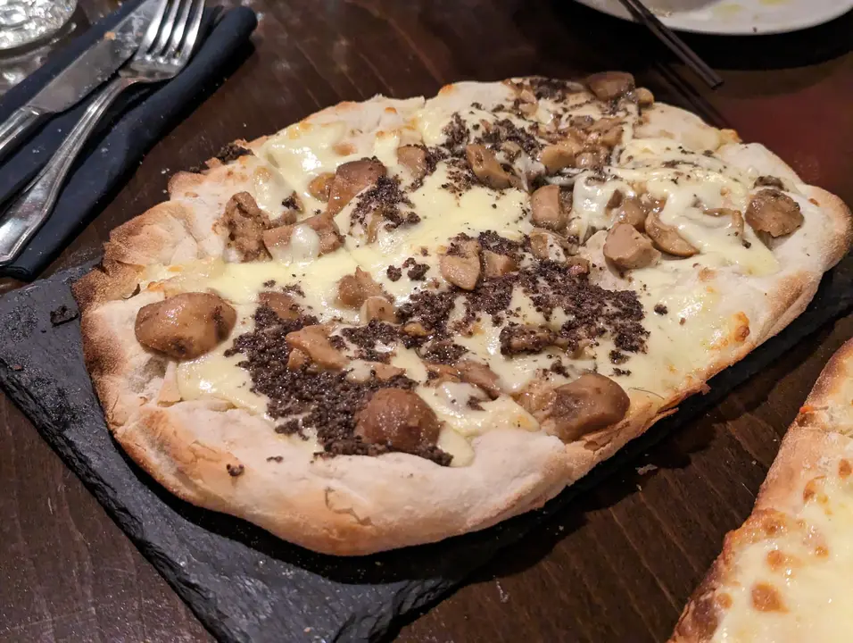
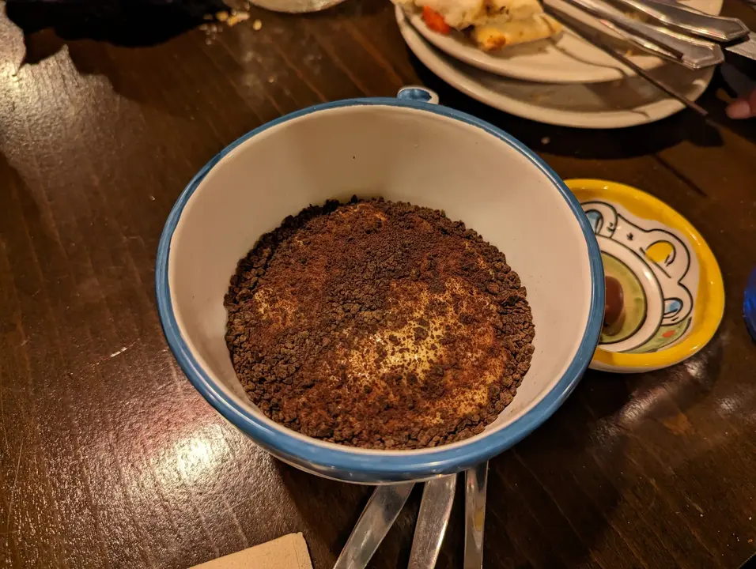
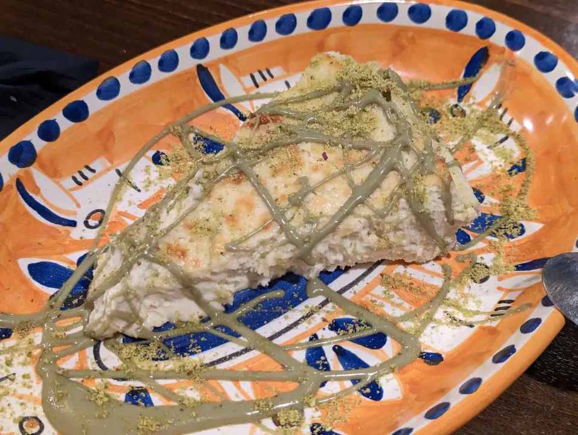
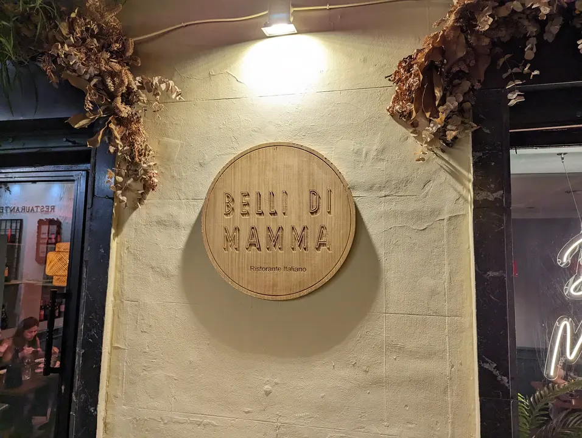

👨‍🍳 Belli Di Mamma @bellidimamma.madrid
📍 Calle Manuel Fernandez y Gonzalez 17 #madrid
💲 Precio: 💲💲
⭐ Valoración: 9
✨ Es uno de mis italianos de cabecera en Madrid en pleno corazón del barrio de las letras.

En este caso pedimos (a compartir para 5):
- Tagliere di formaggi italiani: que es una delicia. No me quedé con todos los quesos pero hay con leche de Oveja e incluso con premios.

- Arrosticini abruzzesi: unas pequeñas brochetas de carne de oveja acompañadas de aceite de oliva aromatizado con romero. Un bocado para la boca

- Pinsas: aunque en la carta ponga pizzas, son pinsas. Es otro concepto. Una masa más parecida al pan, divididas en 6, de diferentes sabores. En concreto en las fotos veis: mortadela, burrata e pistacchio, quattro formaggi, diavola y la funghi porcini e tartufo. La diavola es una de mis favoritas sin duda. Muy sabrosas. Queso del que se alarga, son la leche.

Y los postres no quedan atrás. Pedimos varios de cada pero los que pedimos son:

-Tiramisù della nonna: un tiramisú espectacular. A mi no me hace gracia el tiramisú, pero este me flipa.

-Cheesecake al pistacchio: su joya de la corona. Una tarta de queso cremosa, con crema de pistacho y pistacho en polvo por encima. Sin duda, no podeis dejarlo pasar porque es una apuesta distinta y merece la pena probarla.

Es muy muy recomendable y sin duda repetiré porque ya lo he hecho. Esta es la cuarta vez que voy y super contento. Tendría que haberlo publicado antes pero soy asi :)

#ristorante #italia #comidaitaliana #barriodelasletras