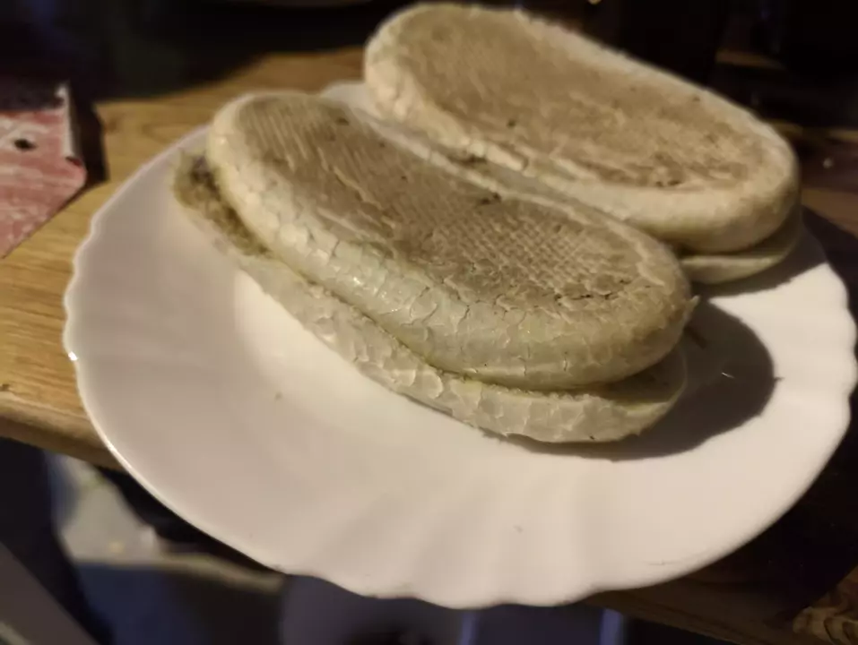
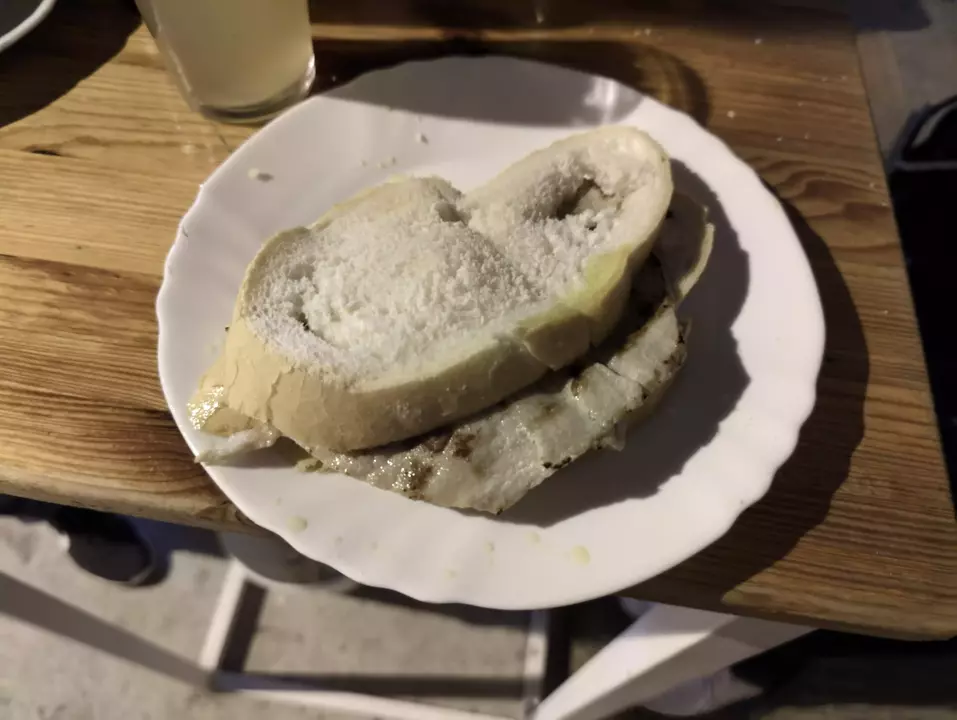
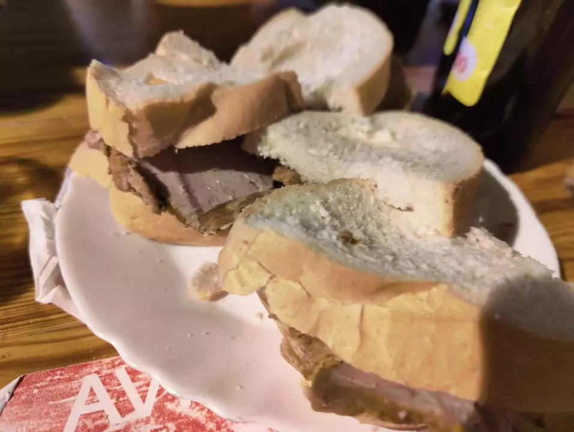
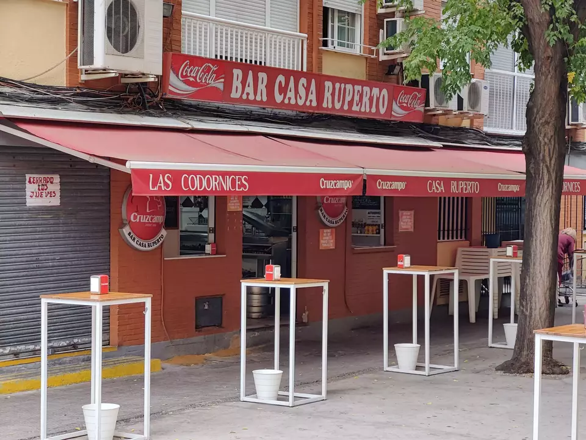

👨‍🍳 Bar Casa Ruperto
📍 Avenida Santa Cecilia 2, #Sevilla
💲 Precio: 💲
⭐ Valoración: 8
✨ Un sitio mítico en Sevilla es Casa Ruperto, la casa de las codornices. Una tapa muy original por 2,8€ una codorniz frita

También probamos los montaditos de pringá, en ese bollito aplastado a la plancha riquísimo de sabor.

Y por si era poco probamos el montadito de lomo especial y el de carne mechada. El pan en este caso estaba una chispa chicloso, pero la carne estaba buena. El lomo calentito y la mechá de la nevera y un poco seca.

Para que os hagáis idea de precio, 4 codornices, 4 de pringá, 2 de lomo, 2 de mechá y 8 bebidas, 42,40€.

Un sitio super auténtico y barato, muy barato para lo que comimos. Super recomendable e imprescindible si pasas por #Triana.

Si quieres ver más sitios que he probado sígueme en https://instagram.com/comidistafoodie 

