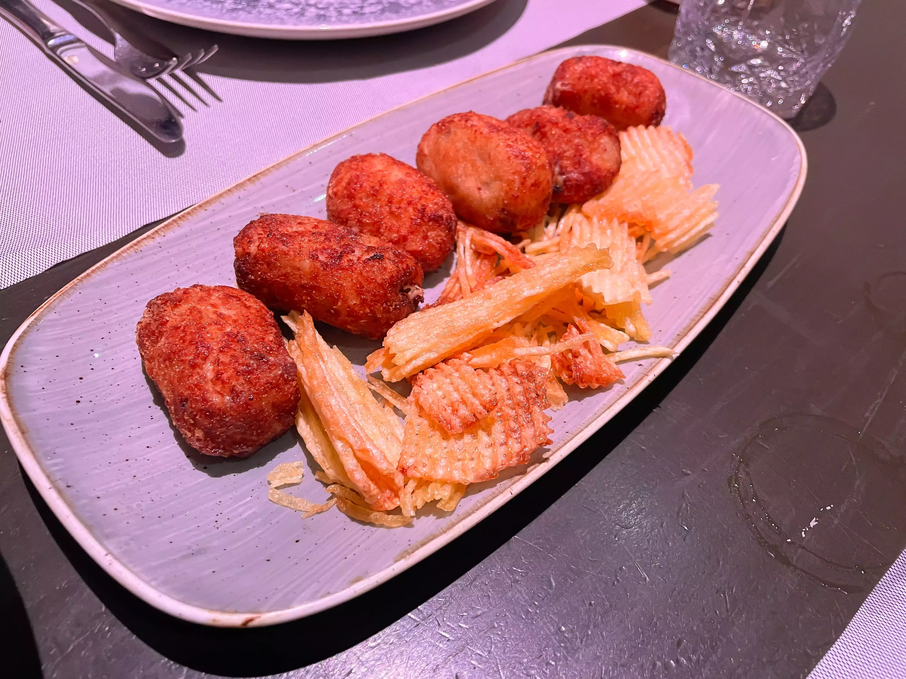
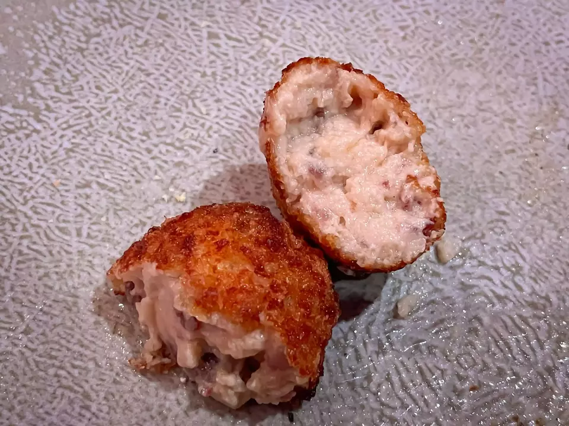
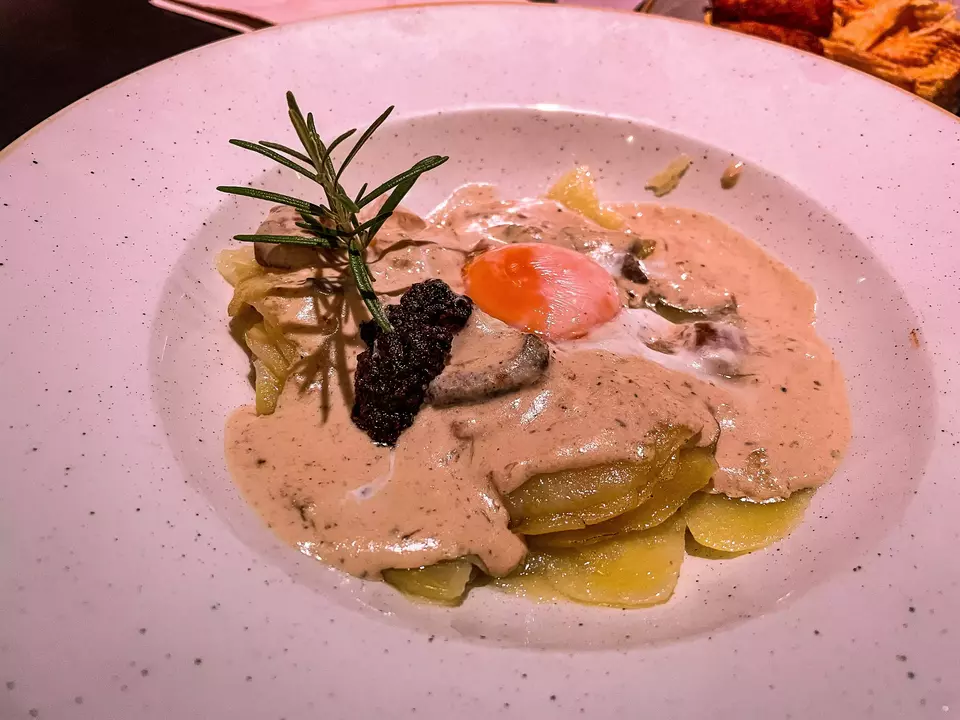
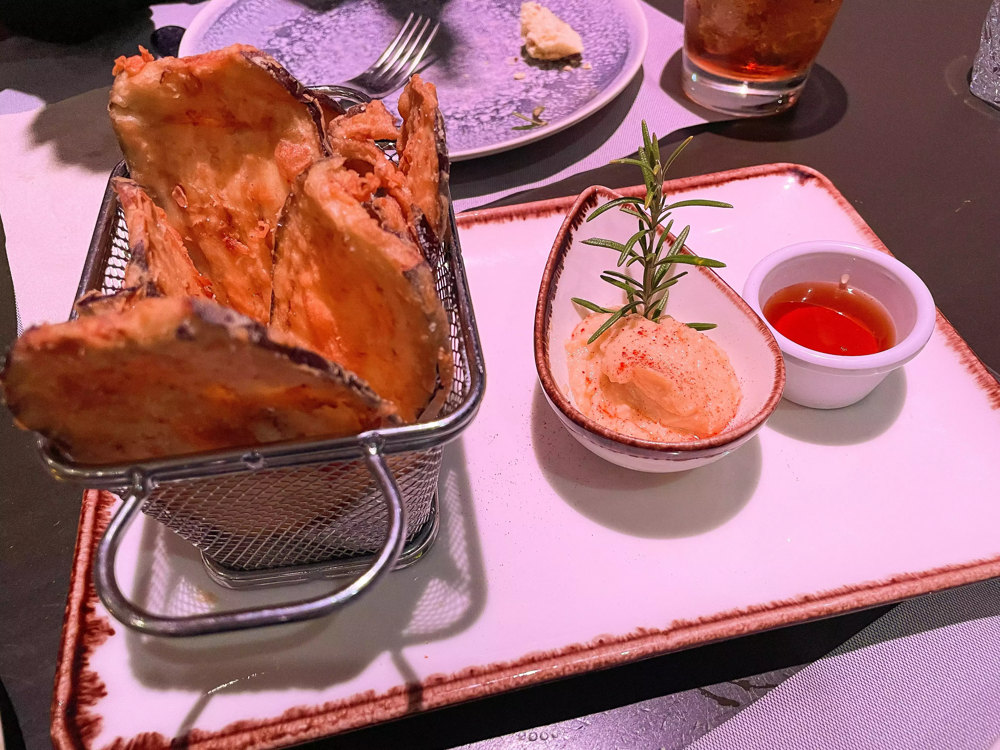
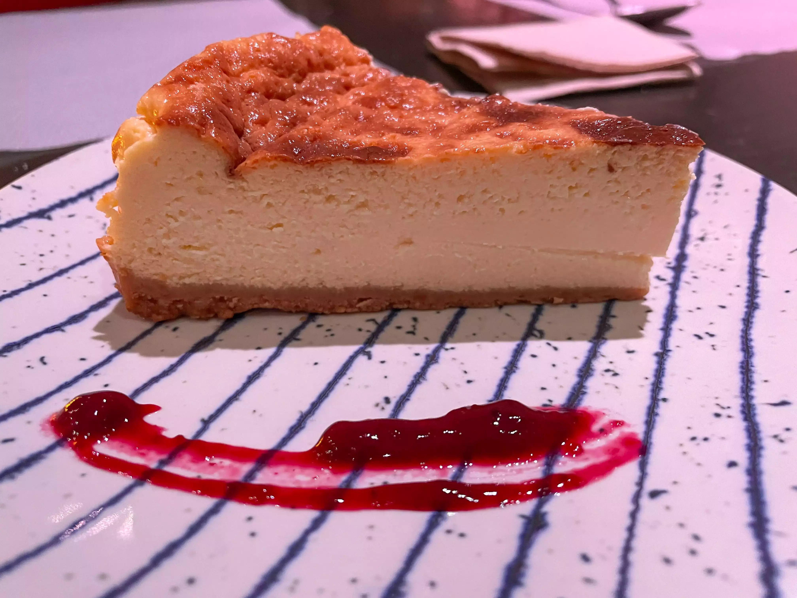

👨‍🍳 Descaro (Soho CLub Madrid) @descaro.restaurante
📍 Plaza de España 6, 2ª planta #Madrid
💲 Precio: 💲💲
⭐️ Valoración: 6
✨ Una experiencia muy agridulce, unos precios nada justificados por la calidad de las elaboraciones y un ambiente en el que comías hacinado y no se podía hablar.

Pedimos para cuatro comensales que comemos poco en cenas:

* Surtido de croquetas cremosas (6 unidades, 12€): Se supone que debían ser mitad de choco y mitad de jamón pero no había de choco. Mal empezamos. Las croquetas en sí estaban buenas, sabrosas, vamos lo esperado. No te vuelven loco pero ni tan mal oye. La verdad que tampoco tenían mal corte:

* Huevo trufado, crema de boletus y parmentier (13€): Una ración muy chiquitita (no compartir si sois más de 2) con huevo sellado en soplete y patatas confitadas. Sabor potente de trufa, el parmentier quizá algo más liquido de lo que me gusta pero igual en general un plato recomendable.

Y os estoy contando los platos tal cual salieron. A partir de aquí, la cosa empezó a caer en picado.

* Berenjena con hummus y miel (12€): Una berenjena frita pero fría, posiblemente esperó en cocina más de lo necesario, con un hummus que no tenía demasiado sabor y un cuenco de miel. Lo de la miel, tiene un pase, pero el hummus carece de sentido con la berenjena, más aún cuando no puedes usarla para mojar, porque si algo tiene el hummus, es que es para dippear.

* Costilla deshuesada a baja temperatura al palo cortado (18€): Este fue el chiste de la noche. No puedes cobrar 18 eurazos por cuatro costillas minúsculas, frías, saladas y acompañadas de 3 pimientos, 3 tomates cherry y patatas de bolsa. Las patatas de bolsa mal, pero que el ingrediente principal esté mal ejecutado, no tiene perdón. Su foto es la de portada.

* La tarta de queso más descarada (6€): una tarta de queso que salvó muy bien los muebles. Por la pinta, parecía un fiasco, pero estaba mejor de lo que parecía. No era fluida pero si que estaba un poco cremosita. De sabor rica. Sin ser la mejor que he probado, tiene mis bendiciones.

Y después de esto, casi dos horas gritando porque no se les había ocurrido nada mejor que poner una fiesta al lado con un dj poniendo música a volumen ensordecedor, un café y colarnos por la escuadra 4 servicios de pan, con colines rancios (de los cuales olvidé hacer foto) nos clavaron 87€.

Sin duda, no repetiré y no puedo recomendarlo. Es una triste gracia porque hace un año estuve y era un lugar super acogedor y esta vez, mal. Muy Mal.

#mediterranea #comidamediterranea