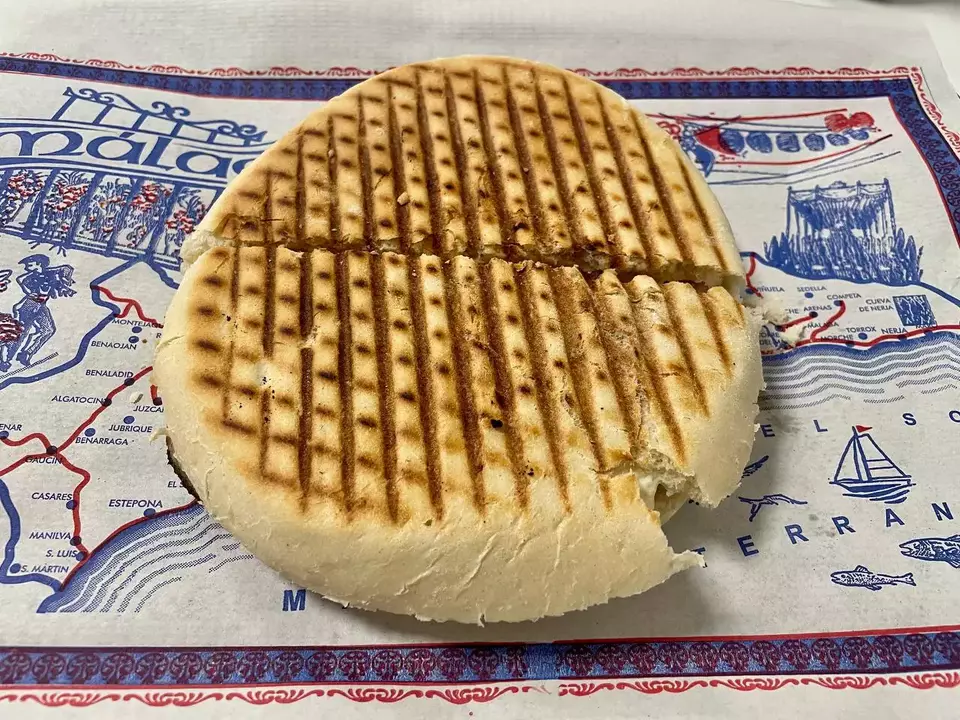
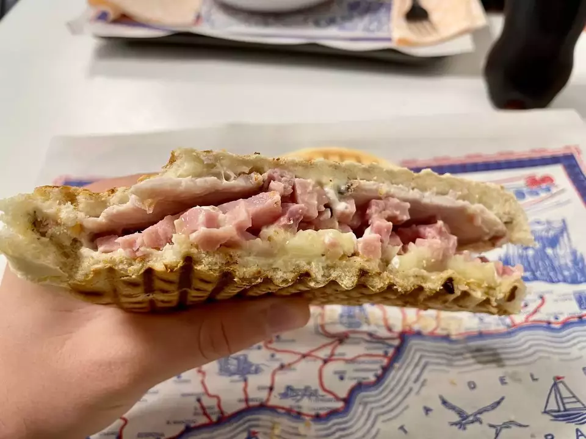
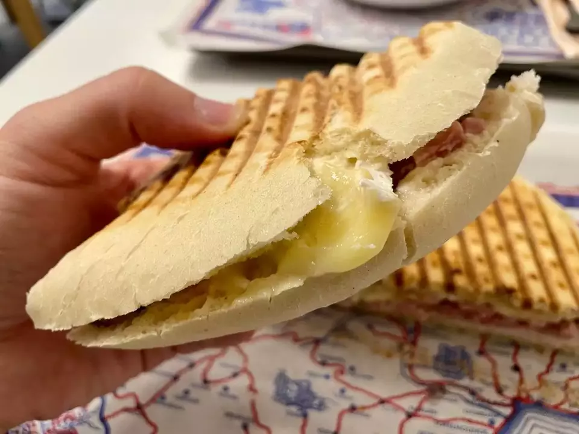
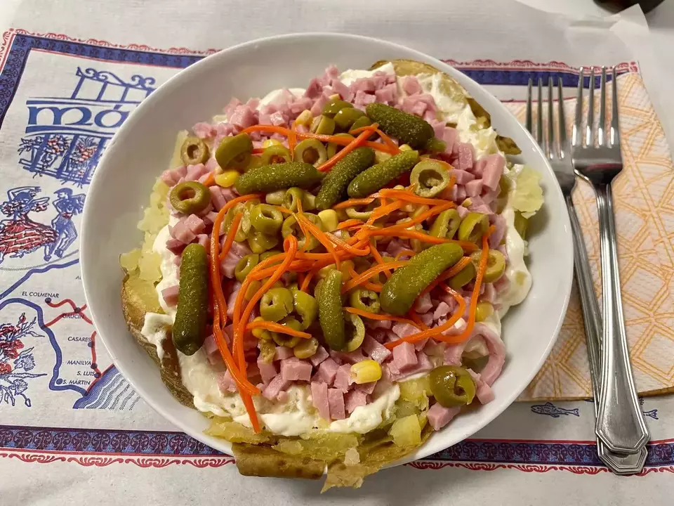
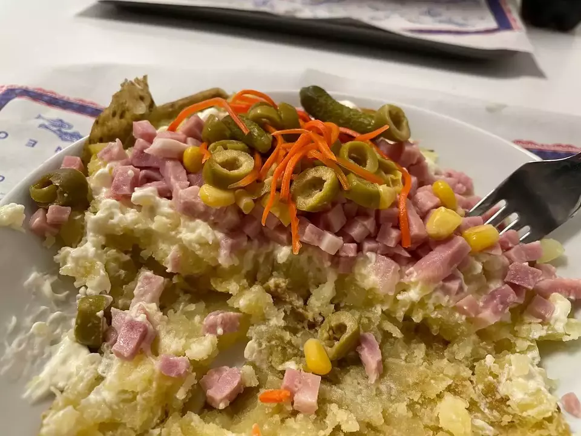
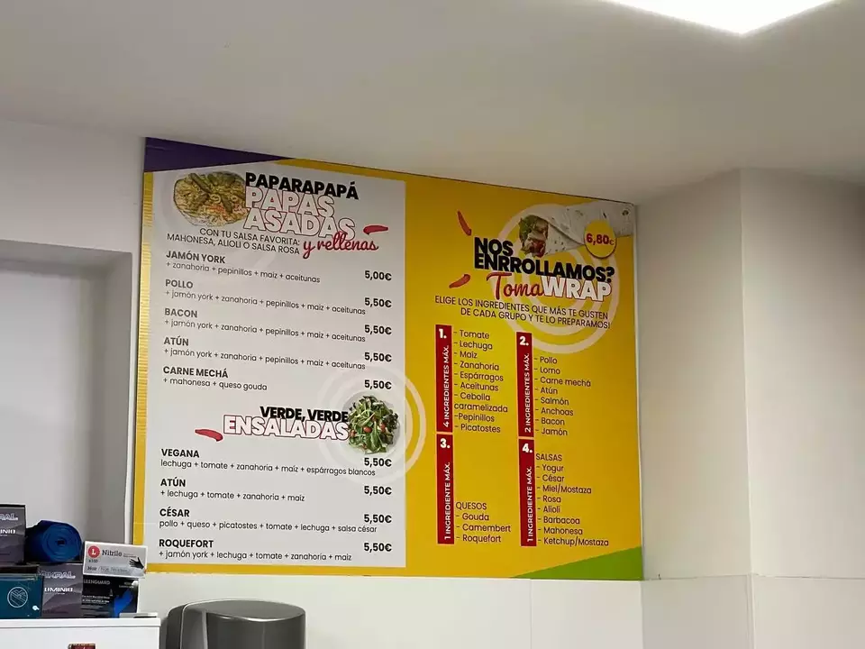
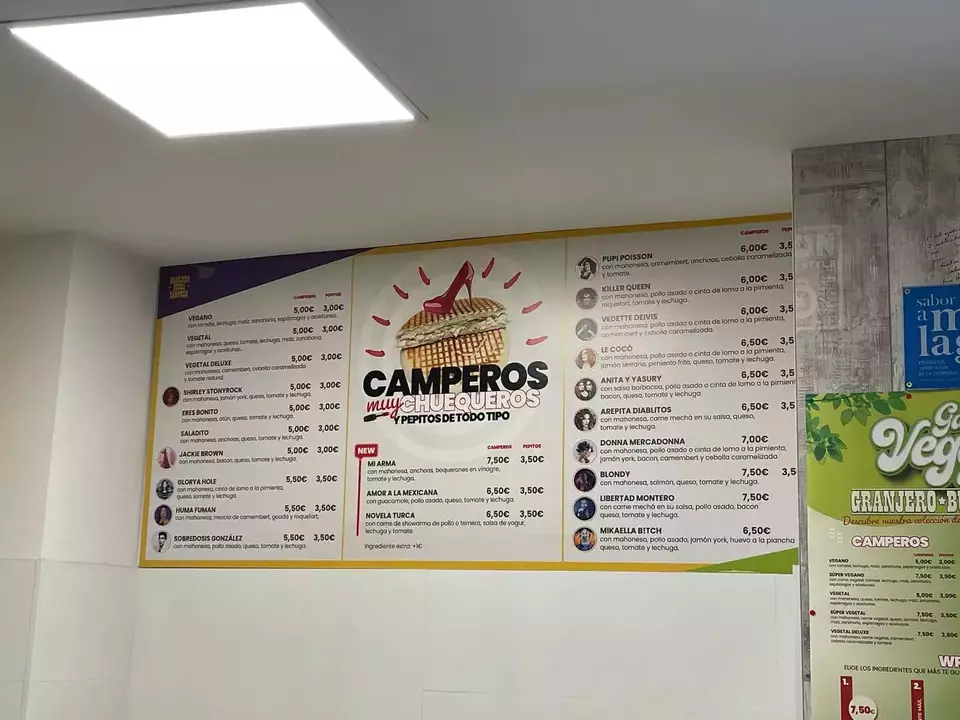
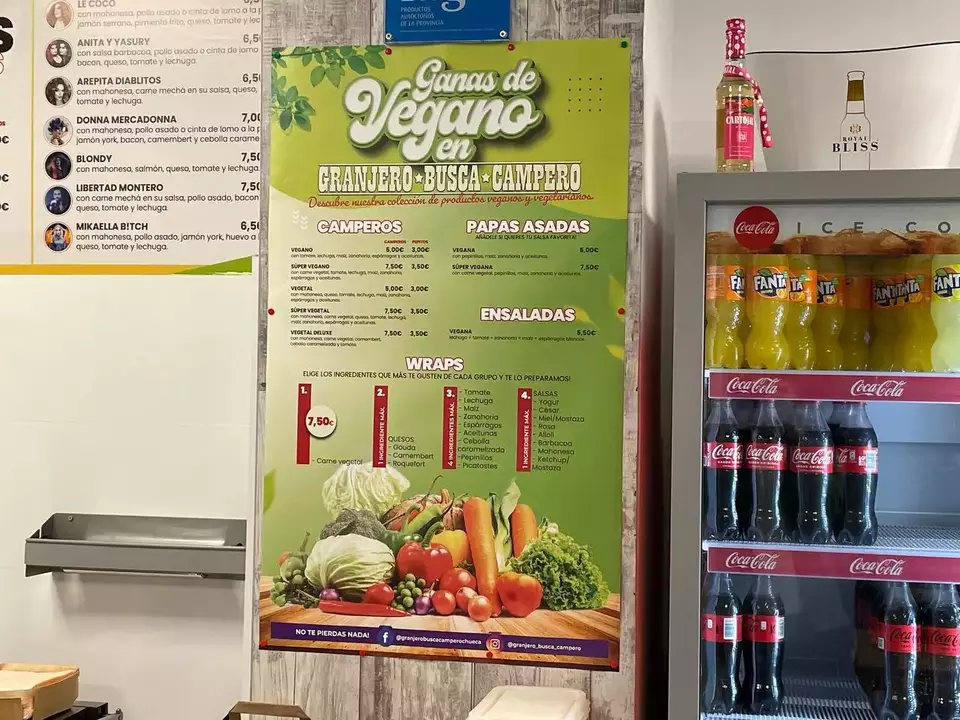
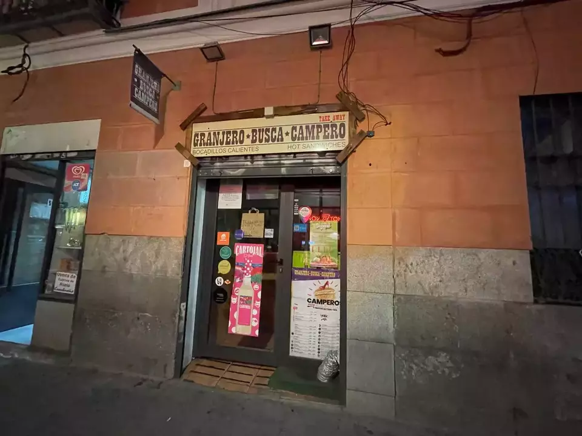
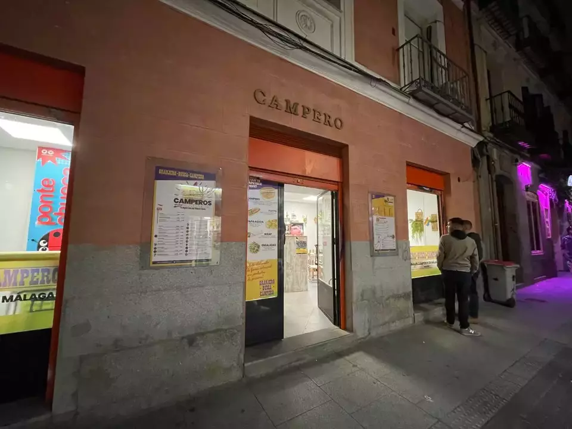

👨‍🍳 Granjero Busca Campero @granjero_busca_campero
📍 Calle Barbieri 13, #Madrid
💲 Precio: 💲
⭐️ Valoración: 8.5
✨ Granjero Busca Campero es un trozo del Rincon de la Victoria (Málaga) en el centro de Chueca. Cuentan con principalmente dos productos de su tierra (reconocido por la diputación de Málaga con el distintivo "Sabor a Málaga").

## Opinión Granjero Busca Campero

Sus productos son:
- Campero: es un pan redondo tostado que traen desde Malaga todas semanas y con una gran variedad de recetas con nombres de Drag Queen. En concreto probamos el "Donna Mercadonna" que incluye lomo a la pimienta, jamón cocido, cebolla caramelizada, bacon y queso Camembert. Estaba riquísimo de sabor y super jugoso en boca. Su precio 7€ y os aseguro que cenais con ello.

Los teneis en formato pepito por 3,50#.

- Papa asada: otro de los platos típicos de la costa del sol. En este caso una patata cocida gigante abierta en canal rellena de bacon, jamon cocido, zanahoria, maiz, aceitunas, pepinillos y mayonesa. Otro bocado con el que cenais seguro.

Sus propietarios, Encarni y Paco son super amables, es como un pedacito de su tierra en el centro del caótico Madrid desde hace más de 7 años. El local solo tiene 5 mesas pero también tienen delivery a casa.

En este caso, fui acompañando a una persona y la experiencia no pudo ser más mejorable. Os recomiendo que os paseis. Es 100% recomendable y estoy seguro que volveré.

## Carta Granjero Busca Campero

Por si os pica la curiosidad os dejo por aquí la carta del Granjero Busca Campero, que incluso tienen cosas veganas:

*NOTA: Antes atendían en el local de al lado, con lo que id al que esta abierto y no al otro. El cerrado tiene un cartel en la puerta para que no os confundáis*

#campero #papaasada