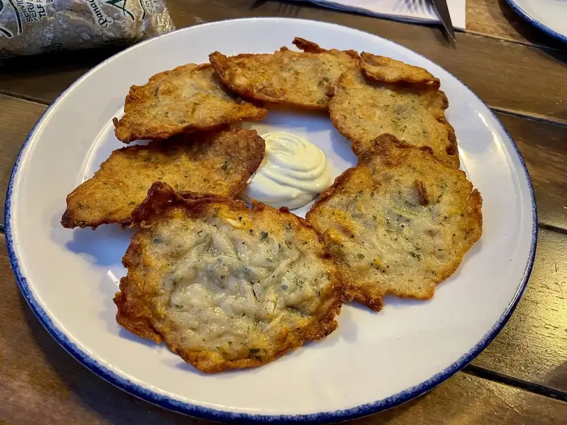
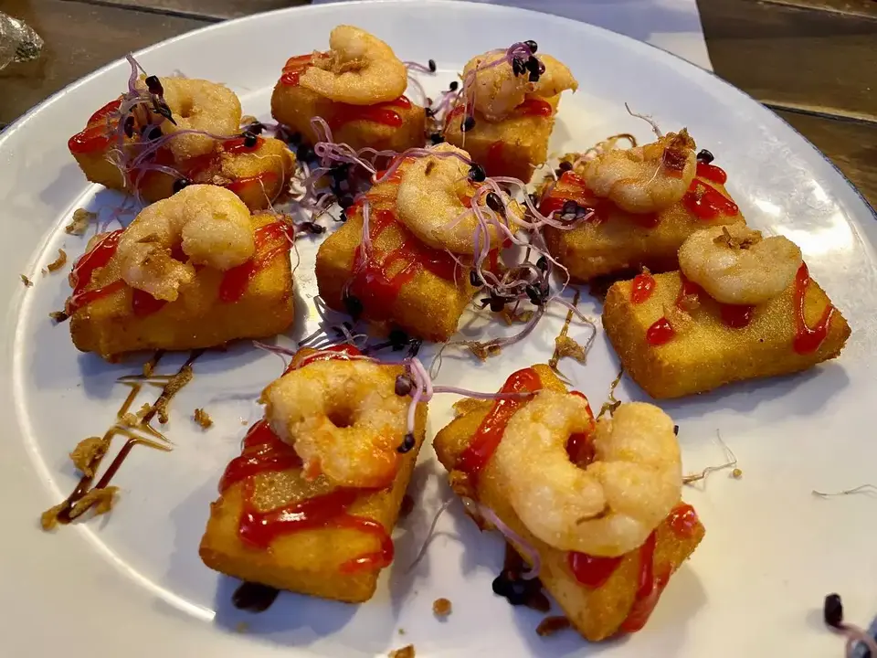
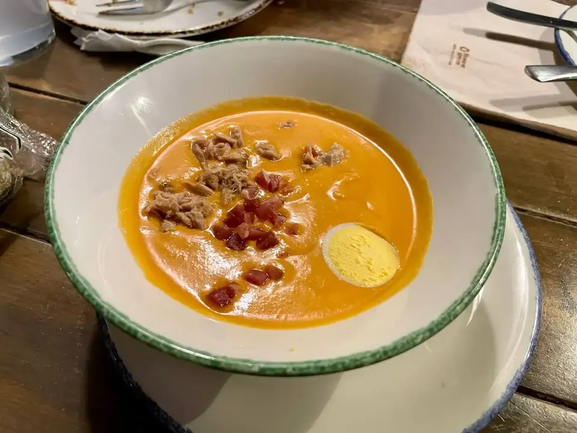
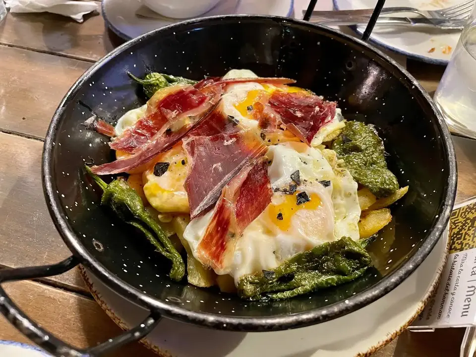
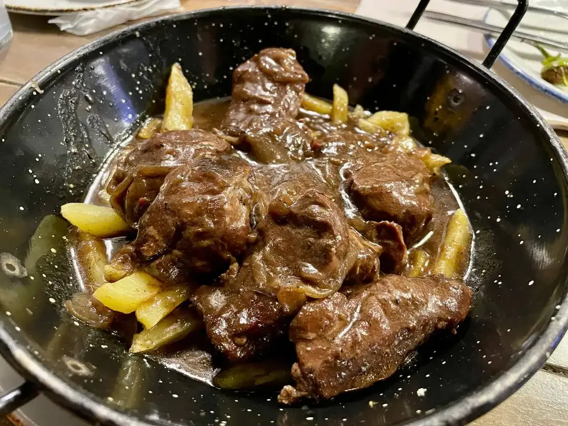

👨‍🍳 La Giralda
📍 Calle Mateos Gago 1, #sevilla 
💲 Precio: 💲💲
⭐ Valoración:  8.5
✨ A priori parecía el típico sitio pegado a #lagiralda donde te van a dar gato por liebre pero que va.

Pedimos:
- Tortillita de camarones: buena aunque para mi gusto le faltaba algún camarón más

- Dados de camembert y langostinos con mermelada: muy sabrosos, el camembert se fundía al tocarlo y los langostinos gorditos y rebozados.

- Salmorejo: bastante bien hecho, acompañado de jamón, atún y huevo duro. La tapa para dos esta contundente.

- Huevos estrellados con jamón: Bien ricos. Quizá el jamón demasiado curado para el plato pero una buena ración

- Carrillada en salsa: muy buen punto de cocción. La salsa estaba para mojar el pan (y eso hice). Acompañada de patatas fritas.

En general es un sitio recomendable. Destacar los 2,60 de media de las bebidas pero cenamos 4 adultos por menos de 20€ por cabeza con vistas a la Giralda. Creo que merece la pena por la ubicación.

#camarones #salmorejo #andaluciafoodies