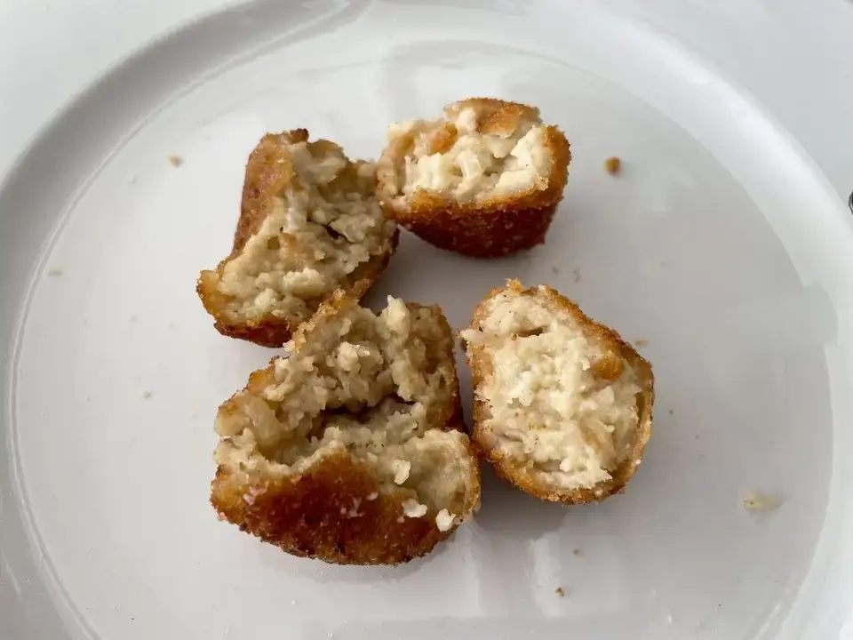
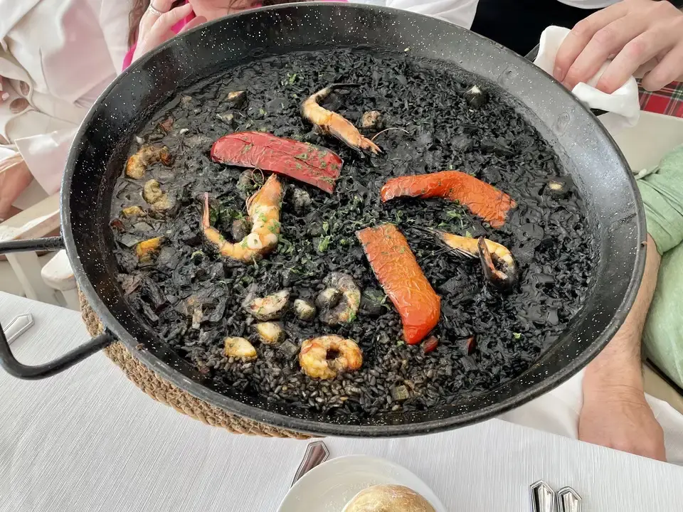
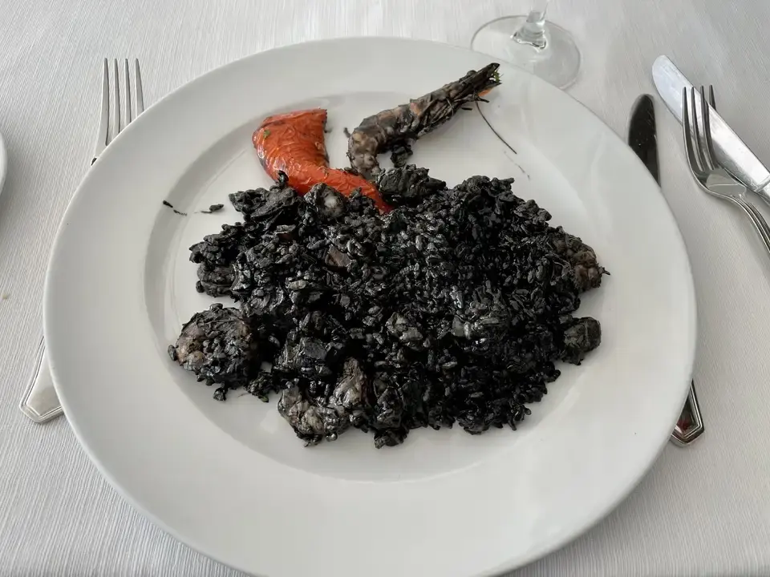
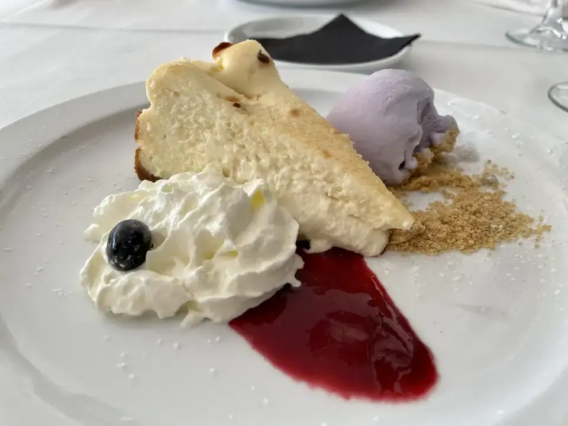
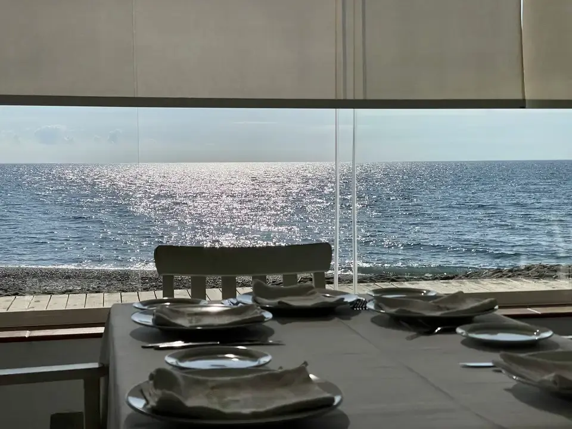

📍 Urbanización Playa Granada s/n #motril
💲 Precio: 💲💲
⭐ Valoración: 8
✨ La experiencia en Los Moriscos fue buena, pero sin ningún alarde de originalidad.

De entrantes pedimos croquetas de cebolla caramelizada y foie y de jamón. El foie era inexistente. En la ración vienen ocho croquetas, cuatro de cada sabor, aunque nosotros pedimos una adicional.

El precio por ración normal son 14 €.

De plato principal, pedir arroz negro. A destacar que el arroz era muy negro, que las gambas venían bien peladas, que el emplatado era bueno y que el sabor era correcto, aunque para mi gusto el arroz estaba demasiado seco y ligeramente tieso.

De postre pedí tarta de queso con helado de violetas. La tarta de queso muy rica, me sorprendió porque era bastante fluida y el helado de violetas estaba muy conseguido, aunque no es un sabor que me llame la atención.

Como en casi todos los sitios de Motril, el café está firmado por @cafessolycrema

En general, buena experiencia, teniendo en cuenta que iba con el miedo de pagar la turistada. Como podéis ver en las últimas fotos tiene unas vistas maravillosas.

#arroznegro #croquetas #costatropical