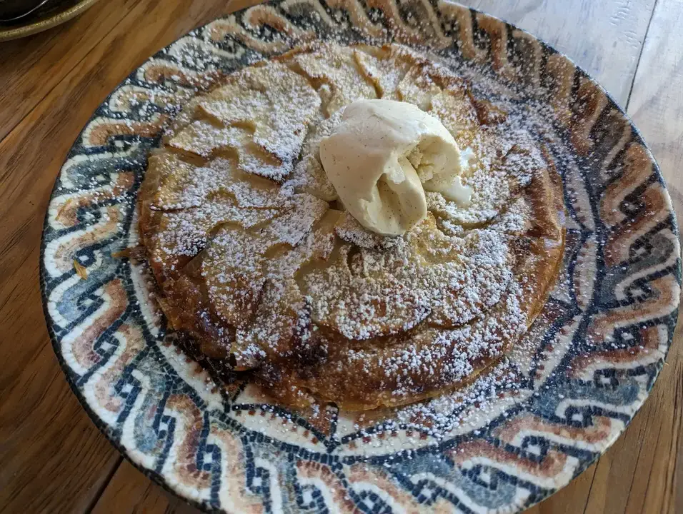

En este post te quiero contar mi experiencia probando la carta de vermú de Makkila Almagro.

## El local de Makkila Almagro
Antes de entrar en materia, quiero presentaros brevemente este restaurante. Es un local triangular (literalmente es una esquina de ángulo agudo) donde nos encontramos un luminoso espacio. Cuenta con dos plantas (tres si contamos el sotano donde están los baños). 

Las mesas flanquean una barra que gobierna la planta a pie de calle, donde probamos lo que os cuento a continuación.

## La carta vermú
> Nota: Esta carta especial de Makkila solo está disponible viernes, sábados y domingos de 12 a 14. Os dejo aquí el link a [la carta vermú de Makkila Almagro](https://makkila.com/carta-vermu-almagro/)

Pude probar:
- Torrezno (4,5€ unidad): Me gustó muchisimo primero que no fuese super grasiento, ya que contenía más magro que grasa y segundo que habían dejado no demasiada corteza, que al freírlo había quedado crujiente crujiente.

- Bravas Makkila (5,5€): Las bravas cañí por excelencia. Fritas como debe ser y con una salsa brava no muy picante.

- Croquetas de pollo asado (8,9€ ración de 6uds): Un sabor espectacular. Me gustó mucho el punto jugoso del interior. Van servidas con salsa Sriracha que va en el fondo de la "huevera" donde vienen servidas. No te olvides de rebañarlo bien.

- Croquetas de carbonara original e Idiazábal (9,9€ ración de 6uds): Una obra de arte. Nos encontramos con una croqueta rellena de carbonara, con un sabor fiel pero sutil, cubiertas con una fina capa de guanciale, con una crema de queso Idiazabal en el fondo de la huevera. Es increible el poder probar el sabor de la carbonara en un formato tan distinto como es una croqueta.

*NOTA: Para poder probar más carta y darte una visión más global, pedimos que como favor especial nos hiciesen una ración mixta y asi probar ambos sabores. Eso explica que haya cuatro con guancciale y dos sin él (Carbonara/Pollo Asado respectivamente)*

- Oreja Crujiente a la plancha (7,8€): Una delicia. Con el churruscado adecuado de la plancha. Con su aceitito sin ser demasiado y con una ternilla muy suavecita. Una verdadera delicia.

- Ensaladilla Makkila (8,5€): Una especialidad de la casa "como la de tu casa". Con sus patatas, sus aceitunas y mucha mucha mayonesa. La guindilla y la aceituna pinchada en el palo me recuerda un poco a las copas de Martini, ¿no?

- Cecina de León con almendras fritas (10,5€): Un plato que aunque parezca que no tiene demasiada elaboración, en Makkila lo sirven con un poquito de aceite por encima, un toque de sal gorda y acompañado de almendras fritas, que nunca me habría imaginado que van tan bien.

## Postres de la carta de Makkila Almagro

Y como queríamos cerrar con algo dulce, recurrimos a la [carta de Makkila Almagro](https://makkila.com/carta-principal-almagro/) y probamos las dos especialidades que nos recomendaron:

- Tarta cremosa de queso con helado de fresa (6,9€): Una de las mejores tartas de queso que he probado. Sin duda está en el top de #Madrid. Cuenta con un núcleo bastante cremoso pero con consistencia. Viene acompañado con un helado de fresa que tiene ese puntito ácido de las fresas que conjuga tan bien con el queso. Si vais y tenéis hueco es un "must".

- Tarta crujiente de manzana con helado de vainilla (7,9€): Y este es el "must" si llegais con poca hambre al postre. Es una base de pasta filo, con manzana Gran Smith, que le da un toque ácido combinado con el azúcar glass, el helado de vainilla y la pasta filo harán las delicias de todos. La ventaja de este postre (que podríais verlo como penalidad si tenéis prisa) es que tarda 15 minutos en servirse porque se hornea al momento. Una cosa que me parece una pasada.

## La filosofía de la carta vermú de Makkila
Cuando conoces lo que hay detrás de una carta, de un plato, de cualquier historia, a mí por lo menos me ayuda a comprender el "por qué" de las cosas y me flipa. Después de probar lo que habéis leído, tuve la ocasión de poder cruzar unas palabras con el [Chef Luis Borda](https://www.instagram.com/chefluighi/), el Chef ejecutivo del grupo Makkila, que me estuvo explicando la idea de esta carta tan particular.

Resulta que después de la pandemia, ellos buscaban con esta carta que las familias volviesen los fines de semana a reunirse en sus restaurantes con los abuelos, los tíos, y en general familia cercana y amigos. Y para fomentarlo, pusieron en marcha esta carta. Y la verdad que, cuando lo estuve probando, el local estaba lleno hasta arriba, así que supongo que su fórmula funciona perfecta.

## Conclusiones
Es un sitio super recomendable. Una cocina de toda la vida pero con toques fusión para darles un lavado de cara en la época actual. Estoy seguro que repetiré la fórmula Makkila.

> En esta ocasión la consumición corrió a cuenta de la casa, por lo que agradezco su hospitalidad y la confianza para poder publicar estas palabras de su local, de su casa.