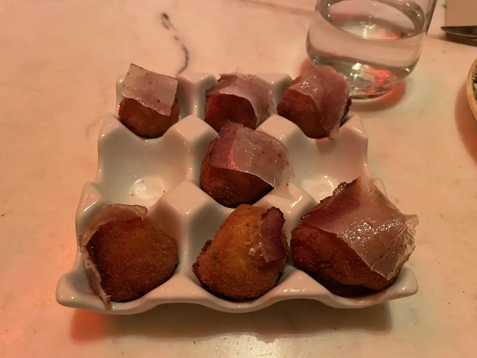
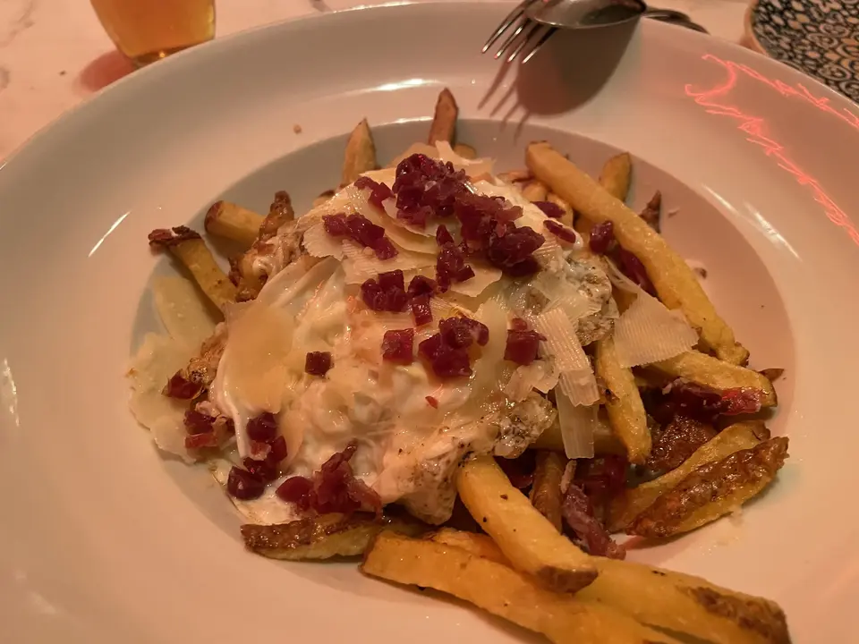
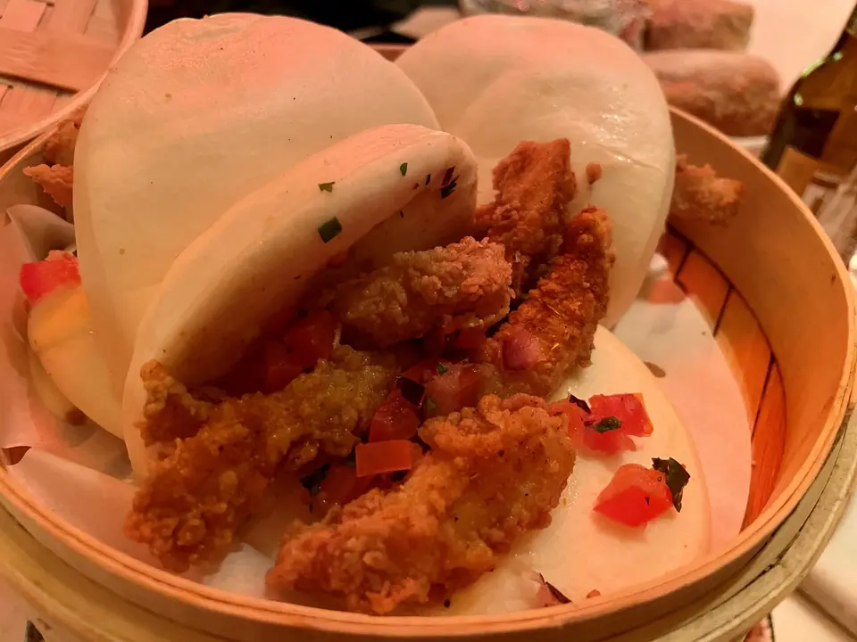
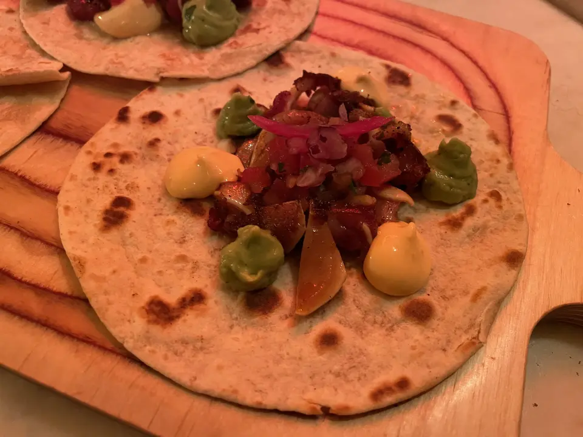
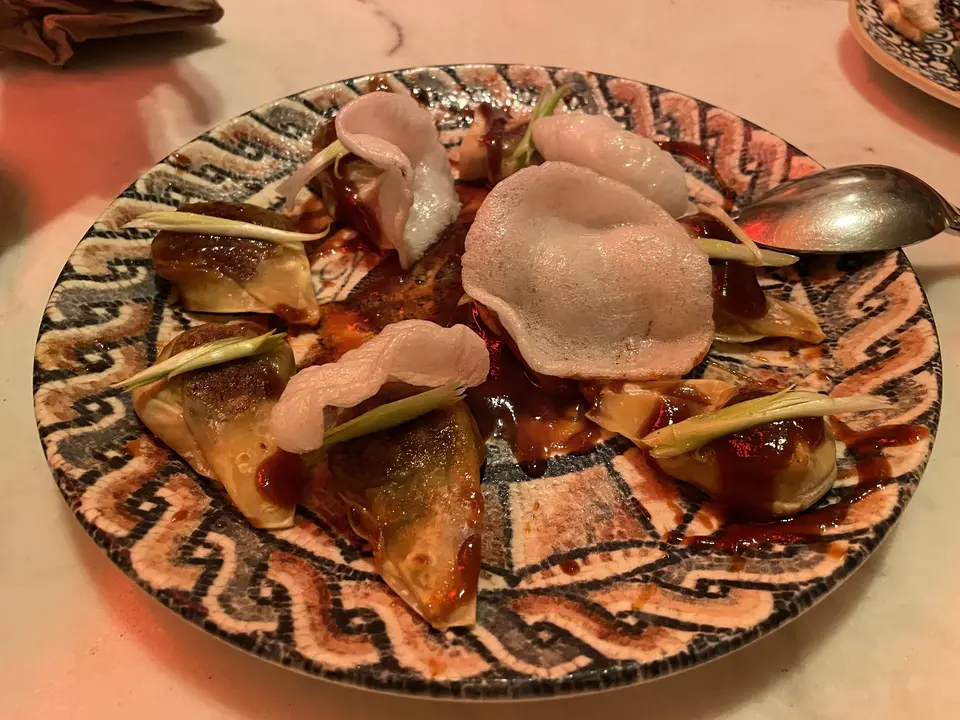
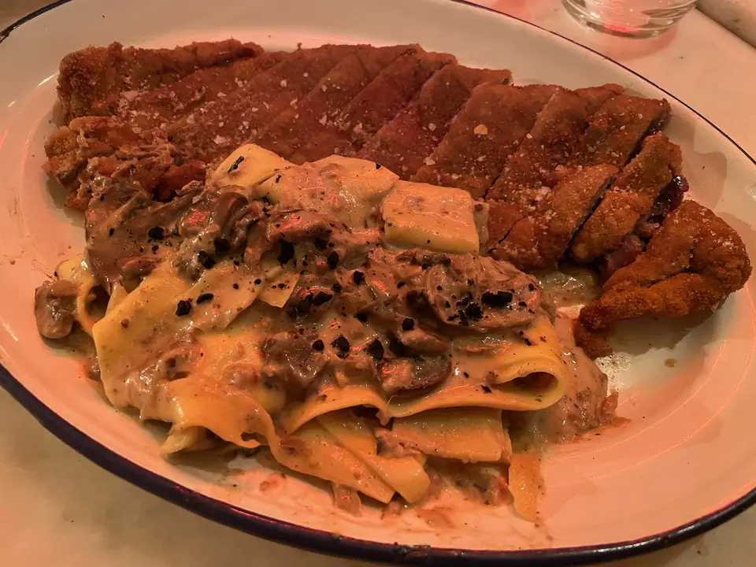
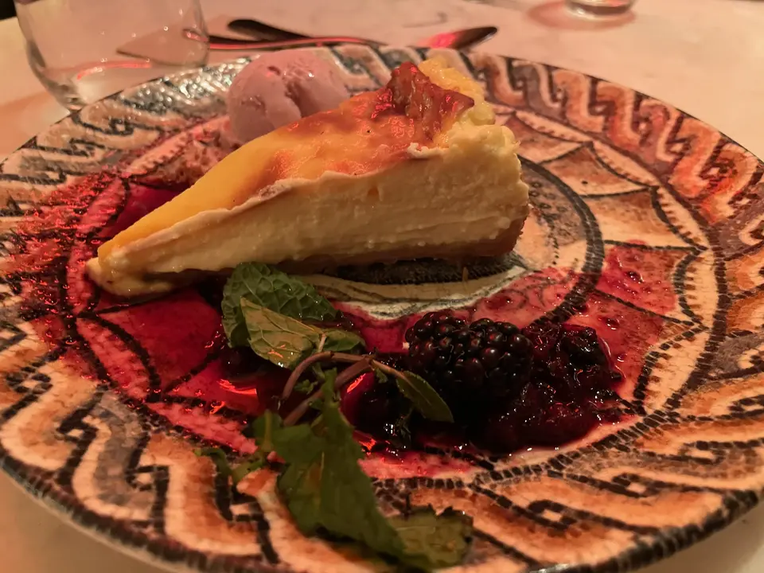
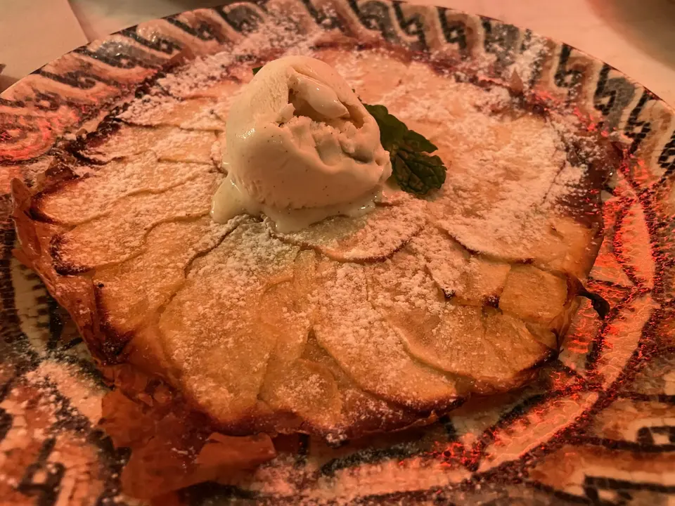

👨‍🍳 Makkila Fernando VI @makkila.restaurante 
📍 Calle Fernando VI 2 #madrid 
💲 Precio: 💲💲
⭐️ Valoración: 9
✨ En esta ocasión he cenado en otro de los locales de Makkila. Los platos que pedimos (en esta ocasión iba con muchos refuerzos):

- Croquetas de carbonara original y queso Idiazabal: Son una maravilla. Un bocadito sabroso a la boca. Son muy fluidas, ¡así que de un bocado!

- Huevos rotos con patatas fritas, jamón Ibérico, Grana Padano y aceite de trufa: una buena versión de los huevos rotos de toda la vida. El Grana Padano le da ese toque que cambia el juego.

- Bao de Rabas de Calamar y agridulce de lima: para mí una de las cosas más sorprendentes de la carta de @chefluighi IMPRESCINDIBLE

- Tacos de oreja, mayonesa de Kimchi y crema de aguacate: Otro bocado de placer. Cuando llegas a la oreja y esta crujiente es espectacular.

- Gyozas de Chili crab con Hoisin y pan de gambas: esto es un bocado de mar. Si no te gusta mucho el mar, puede que no te encaje. En mi caso, me encanta el mar, y esto fue una delicia.

- Cachopo de ternera con cecina y queso semicurado acompañado de parpadelle al gunghi tartufo: Un plato a compartir. Un cachopo potente de cecina y queso, que luchan en la boca por predominar entre sí y luego los parpadelle con ese sabor a trufa … Un plato muy recomendable

- Tarta cremosa de queso con helado de fresa: Una de mi top. Ya la probamos en el otro Makkila así que no dejéis de revisar la otra review.

- Tarta crujiente de manzana con helado de vainilla: Otro postre sorprendente, el dulce por si no has dejado espacio (super ligero). Una maravilla.

Cuantos más Makkila pruebo, más me gusta su cocina. Tienen una carta sorprendente, con muchas influencias diferentes pero que acaban ligando ideal en sus restaurantes, que tienen mucho encanto. Lo recomendaría y seguro que vuelvo.

Si quieres ver más sitios que he probado sígueme en https://instagram.com/comidistafoodie

#cachopo #tartadequeso