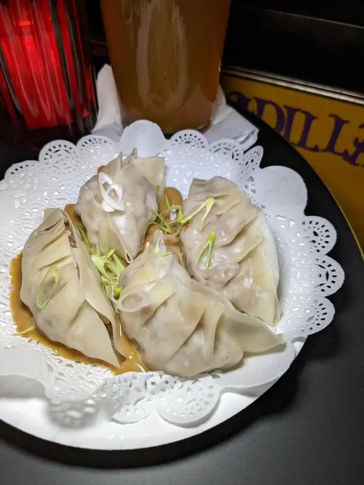
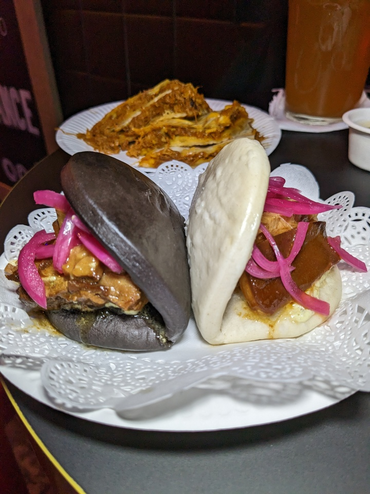
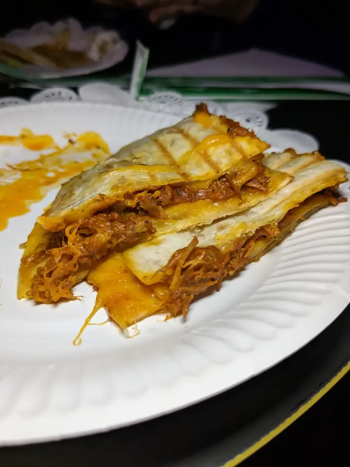
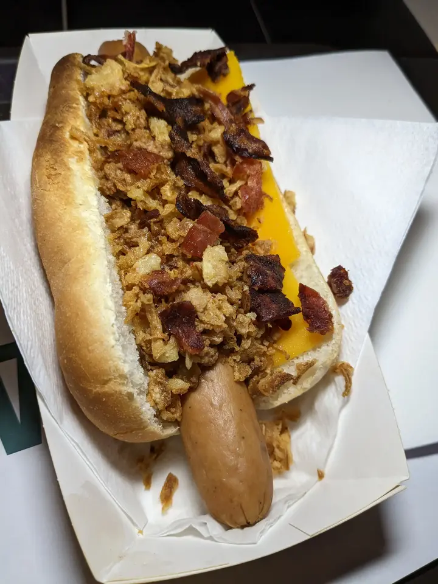
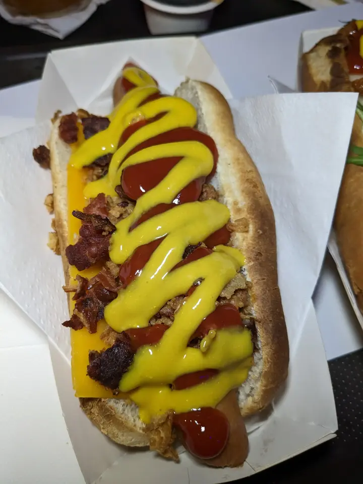
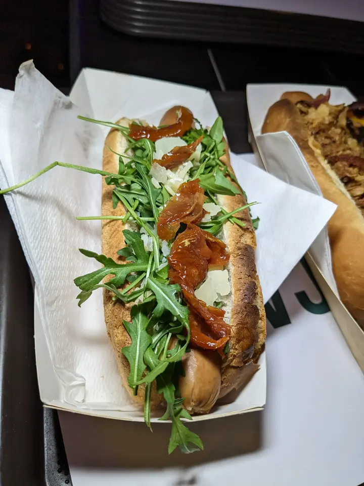
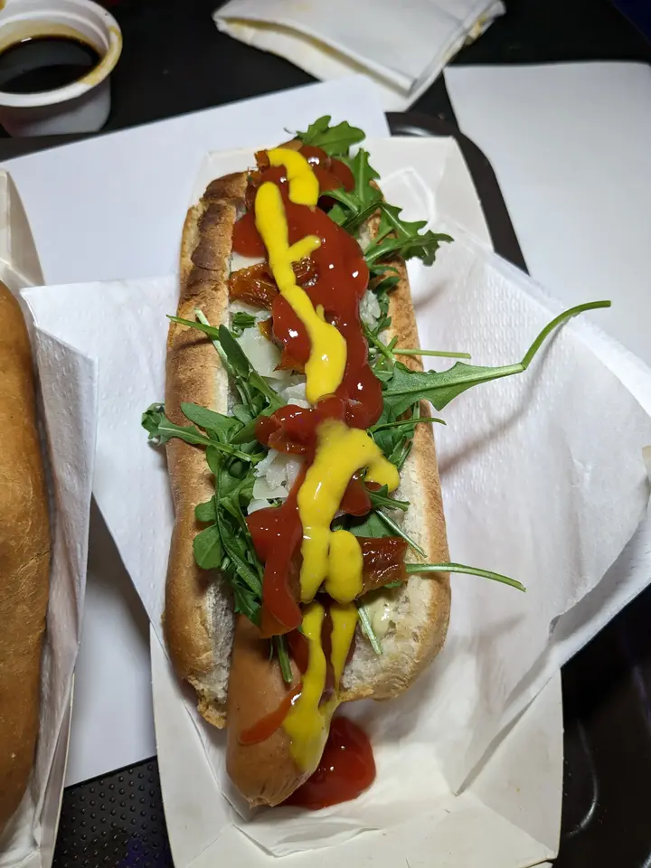
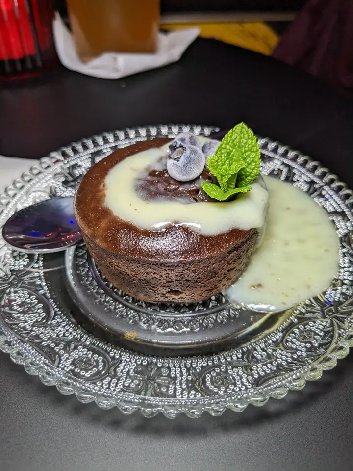
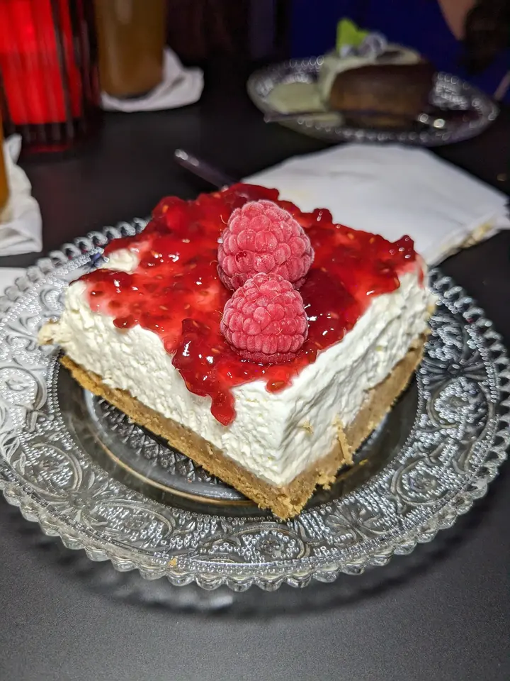

👨‍🍳 Rockade Dance and Food Malasaña @rockade.bar
📍 Calle del Marqués de Sta. Ana, 11, #Madrid
💲 Precio: 💲
⭐ Valoración: 8.5
✨ Rockade Malasaña es un local muy especial donde puedes ir de fiesta y cenar algo muy digno.

En mi visita (fui con ayuda) pedimos:

- Gyozas de pato al limón: están bastante sabrosas y el pato estaba bastante tierno para el tipo de carne que es. Venían 4 y su precio es 8€

- Bao de panceta: mi plato favorito. La panceta está súper tierna, la cebolla encurtida le haga un gusto increíble y la salsa de pepinillo redondea el plato. Venen dos baos, uno negro y uno blanco. 7,50€

- Sincronizada de cochinita: consta de una torta de maíz, una capa de queso, otra torta de maíz, la capa del relleno, en este caso cochinita Pibil, y una última torta de maíz. 7,60€

- Perrito caliente americano: viene con la salchicha, Bacon, carne picada, queso cheddar y mayonesa de pepinillo y mostaza. Un clásico. 7,80€

- Perrito caliente italiano: el plato que nos pareció más flojito, venía con una salchicha, queso, parmesano, rúcula, tomate seco y mayonesa de pesto.

Para "regar" todo esto cayeron dos pintas de Franziskaner que estaban a 5,40€

Para cerrar, pedimos:

- Coulant de chocolate del cual no sé el precio porque no estaba en la carta. No esperéis un interior fundido, porque no lo tenía.

- Tarta de queso, viene en una ración más contundente, es una cantidad suficiente como para matar el mono de dulce diría que no está hecha casera y su precio es de 4,70€.

Es un concepto muy distinto al resto de la oferta gastronómica de la zona. Sin duda, repetiría

Gracias a Rockade por la invitación

#burguer #cheesecake #coulant #hotdog #perrito caliente #gyozas #arcade #malasaña