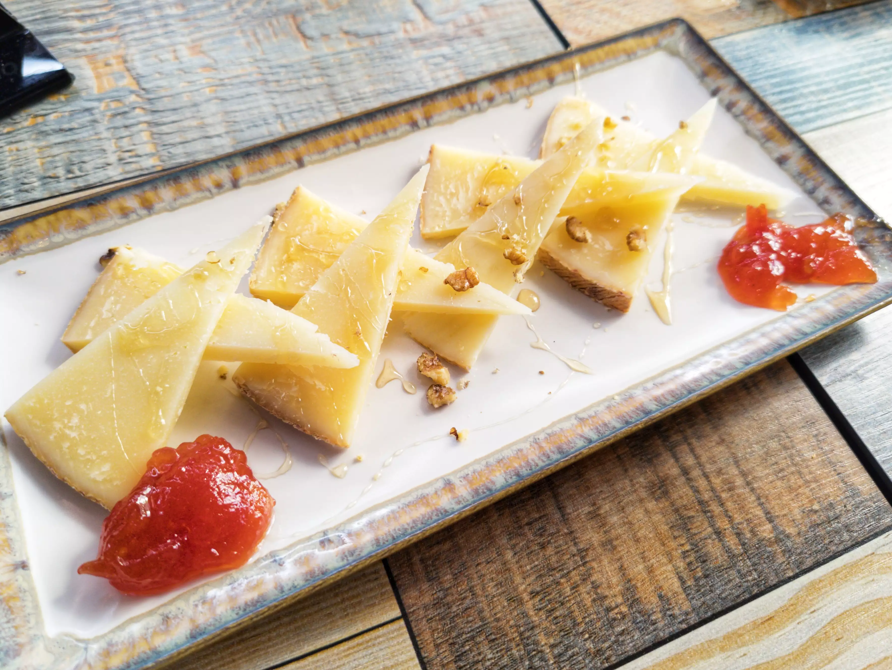
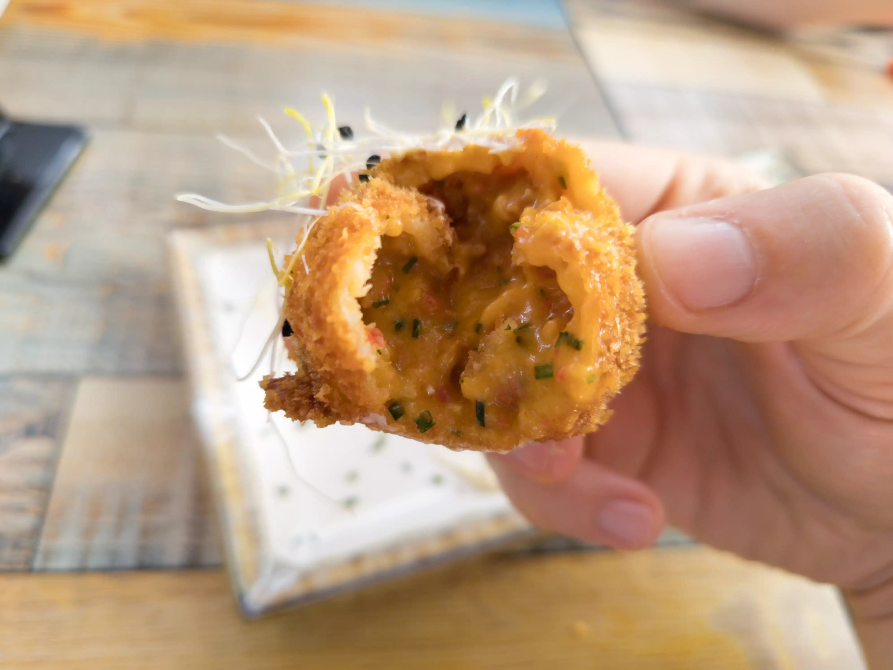
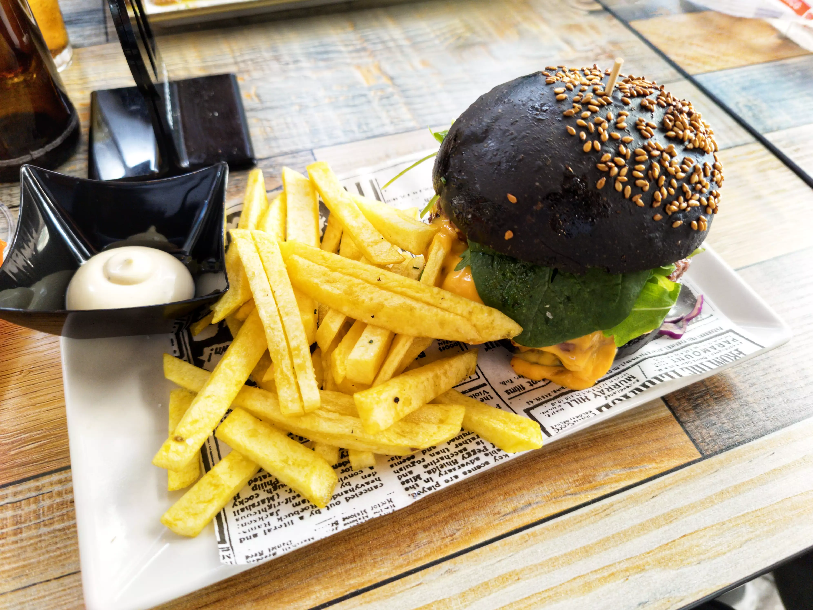
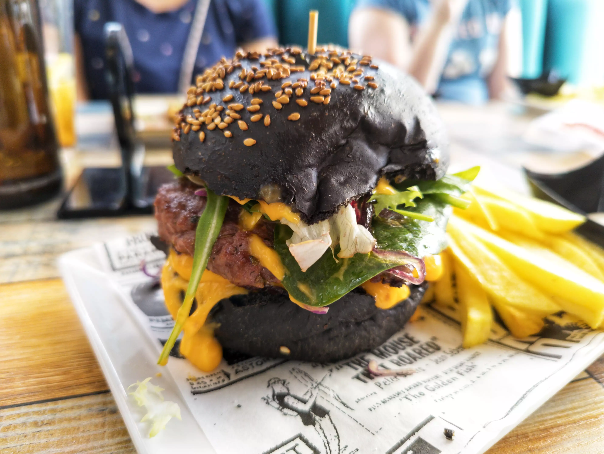
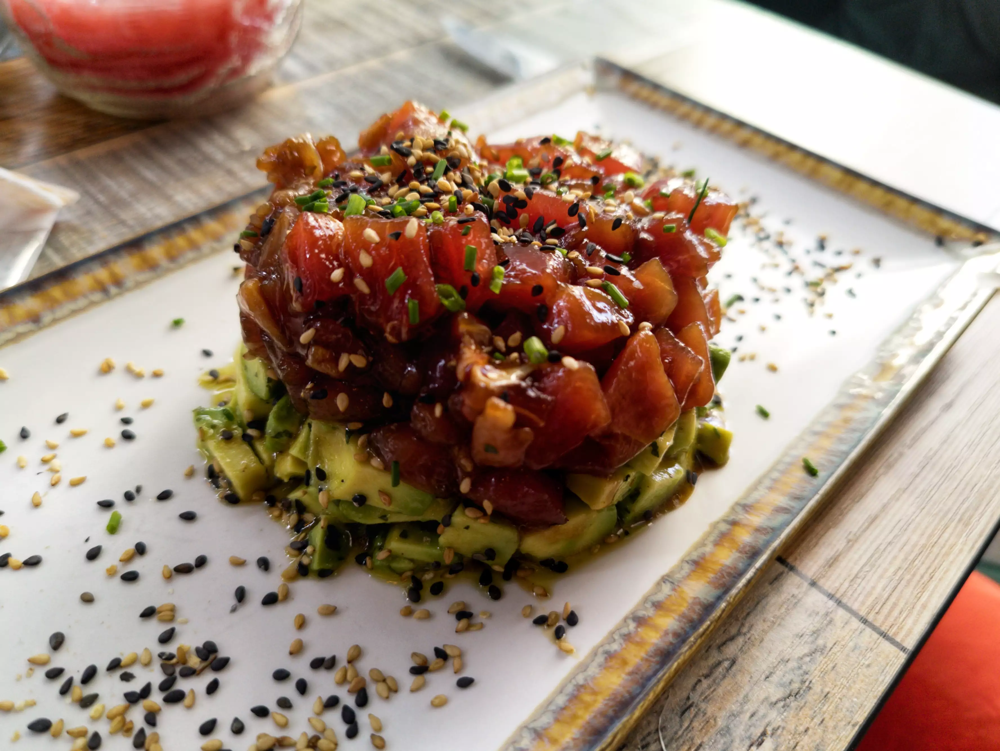
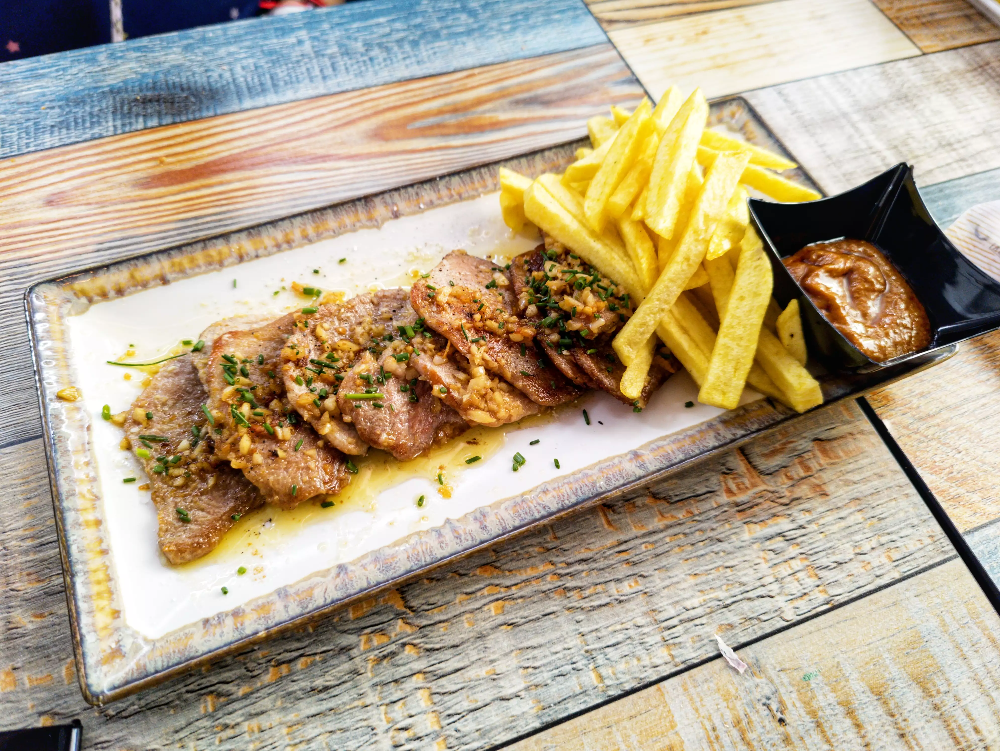
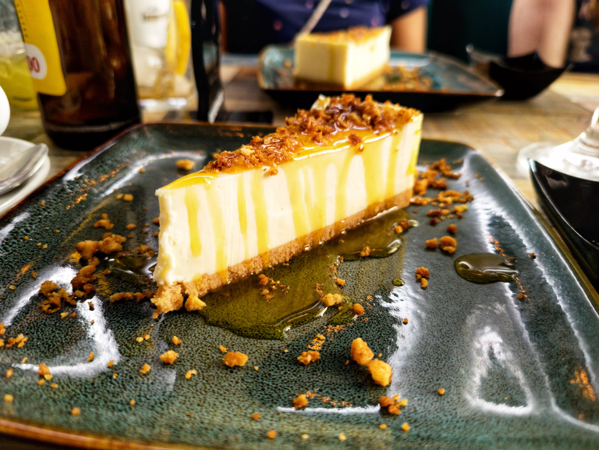

👨‍🍳 Único gastrobar @unico_restaurant
📍 Calle Zaragoza 43 #sevilla
💲 Precio: 💲💲💲
⭐ Valoración: 6
✨ Siendo Sevilla una ciudad con una gastronomía competitiva, con este nivel no creo que dure mucho.

Los platos son:
- Queso Viejo De Cabra servido con miel y mermelada: esperaba algo especial, pero es una cuña de queso cortada con mermelada y miel por encima pero nada especial.

- Croquetas único de chorizo y provolone: de lo mejor que comimos allí. Muy ricas de sabor. El rebozado se quedaba con su forma a pesar del bocado como veis en las fotos.

- Hamburguesa black: bastante normalita. La carne de buena calidad pero bastante común al paladar. Con cebolla caramelizada, queso y lechuga. Correcta sin más.

- Tartar de atún: buen sabor. Solo aguacate y atún con unas tostaditas que tardaron varios minutos en llegar.

- Solomillo ibérico a la salsa con ajillo al vino oloroso: el solomillo una aberración. Era como una suela de zapato Muy tieso La salsa buen sabor pero en general no lo recomendaría

Por último os hablaría de los postres pero solo había 1 de los 4 de la carta, la tarta de queso

- Tarta de queso con mermelada de frutas del bosque: Si tengo que apostar diría que era de las que compras para hacer en sobre. De hecho venía con miel en lugar de mermelada y tuvimos que pedirla aparte.

La verdad es que fue un caro despropósito (casi 120€ de cuenta para 4).

No lo recomendaría y no lo repetiría.

Si quieres ver más sitios que he probado sígueme en https://instagram.com/comidistafoodie

#sevillafood #foodiessevilla