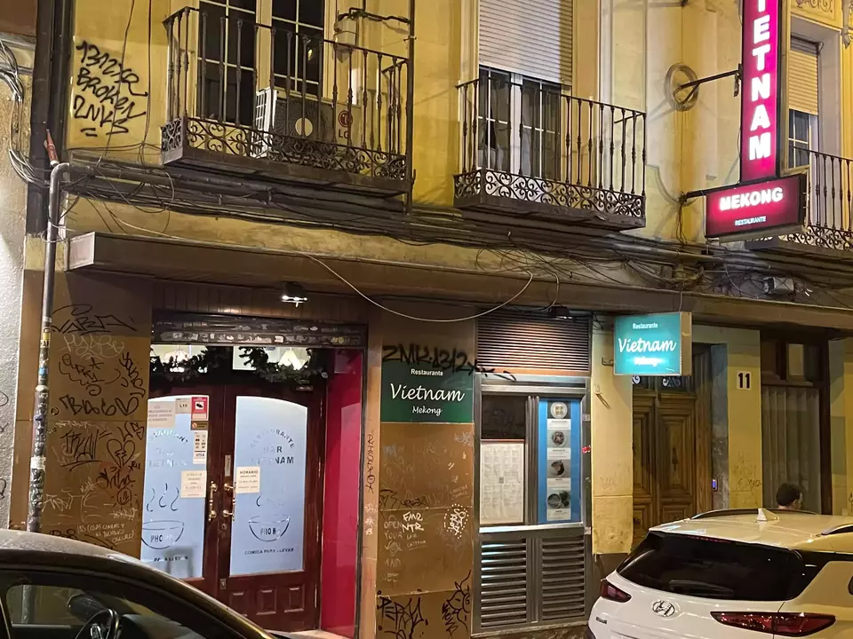
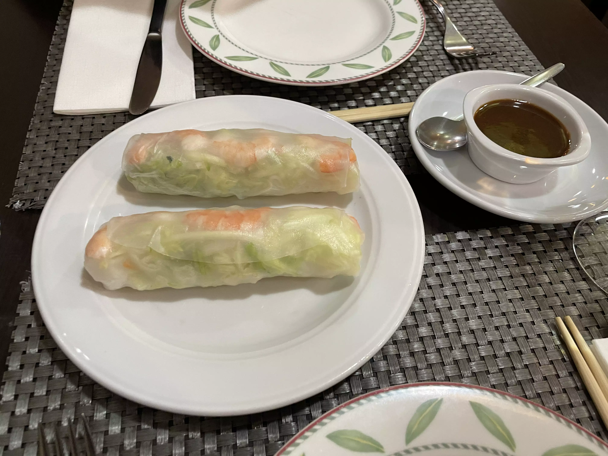
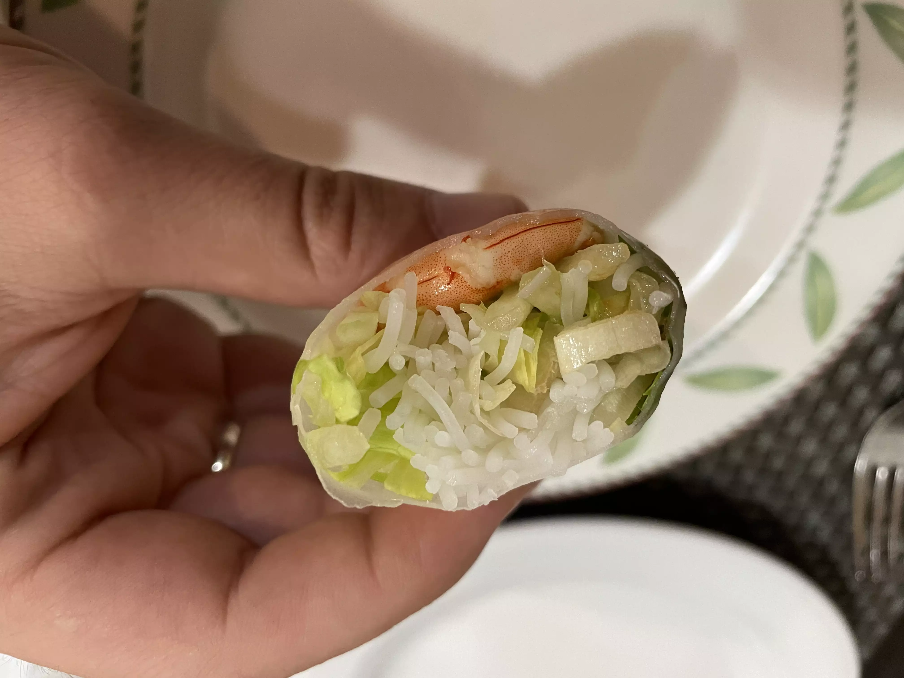
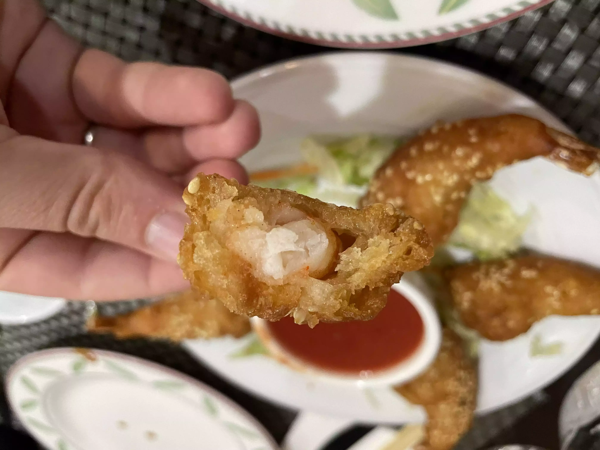
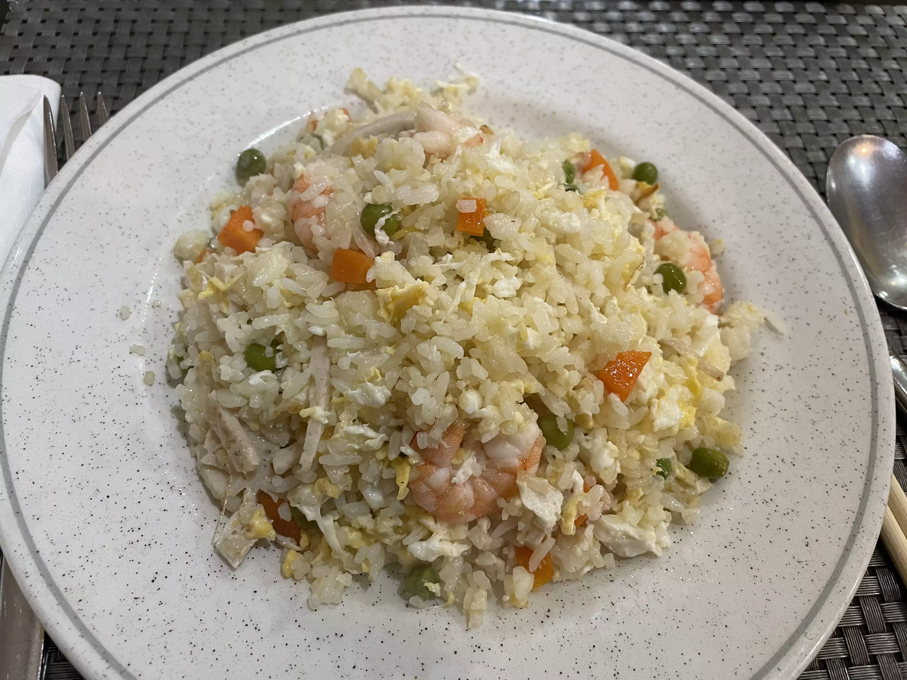
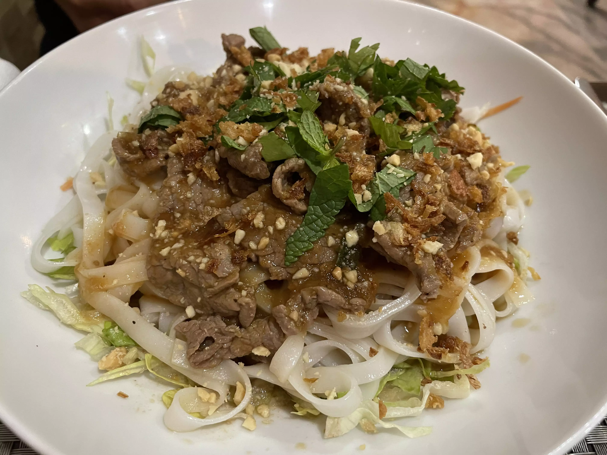
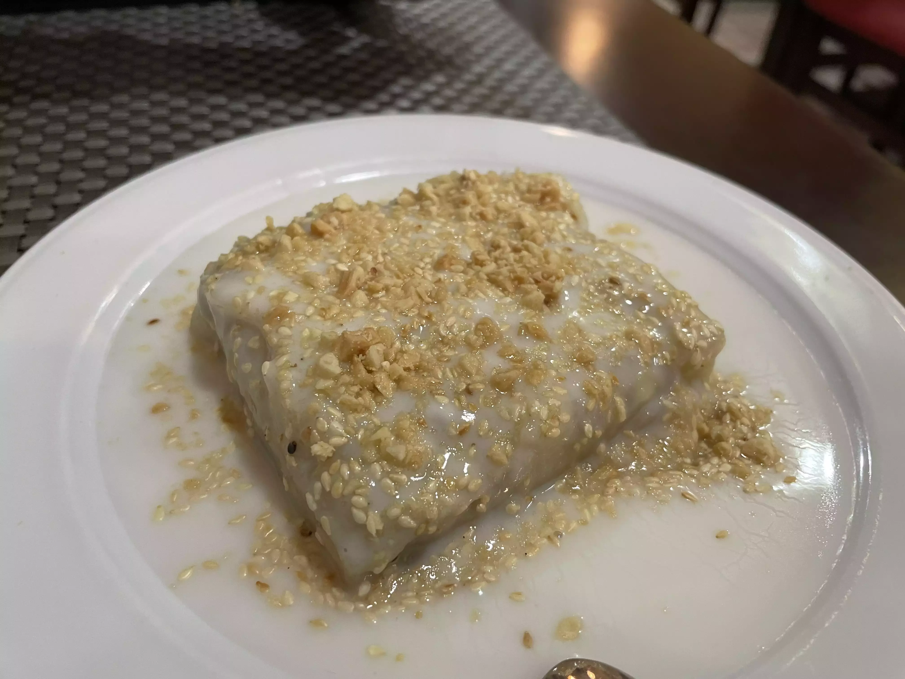
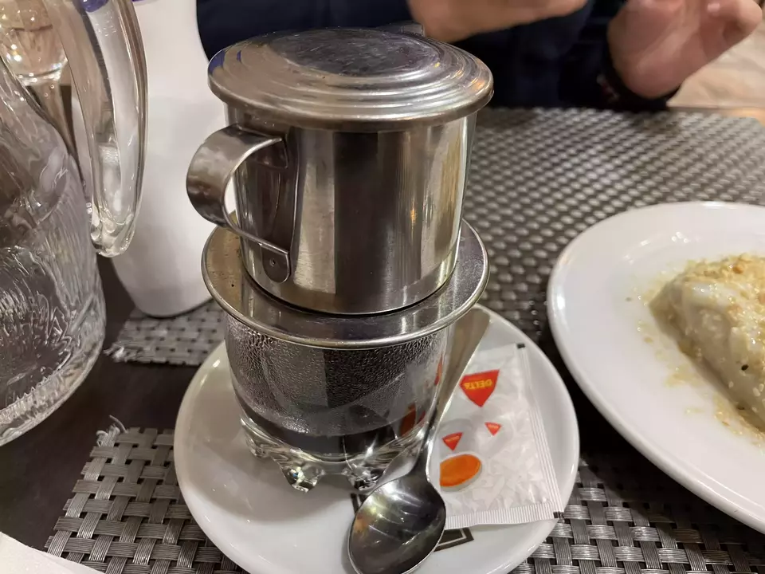
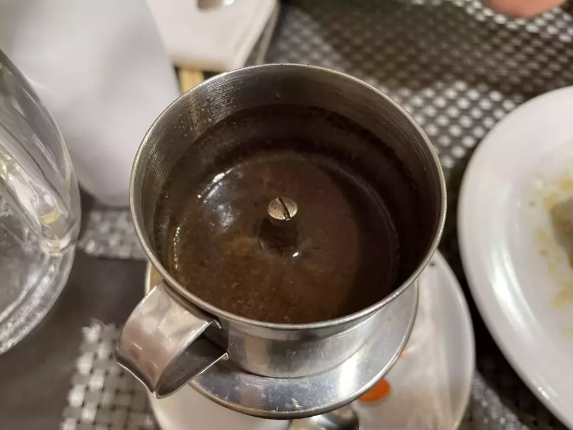
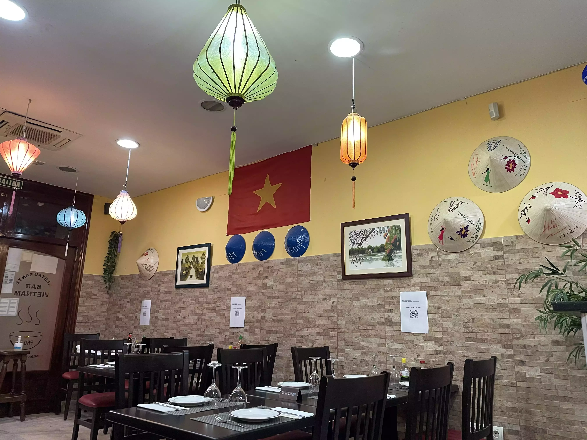

👨‍🍳 Vietnam Mekong
📍 Calle de Isabel la Católica 11 #Madrid
💲 Precio: 💲💲
⭐️ Valoración: 8.5
✨ La verdad que, en mi trayectoria de foodie, no he visitado muchos restaurantes vietnamitas. Pero en pleno centro de Madrid tenemos el Vietnam Mekong.

Entrando en materia os dejo los platos que pedí:
* 3 GỎI CUỐN TÔM (3,90€) un rollito de papel de arroz con lechuga, zanahoria, pepino, hierbabuena, fideo de arroz y langostinos cocidos. Es un poco soso, por lo que viene acompañado de una salsa de la cual no descubrí los ingredientes. Curioso pero contundente.

* 19 TÔM TẨM VỪNG (11.95€) langostinos rebozados con sésamo. Un rebozado distinto a lo que estamos acostumbrados, con mucho cuerpo. Trae una salsa que igualmente no sé de que estaba hecha (parecía de tomate)

* 13 CƠM RANG THẬP CẨM (10.50€) parece como un arroz tres delicias hecho al wok. Muy plano de sabor y no es amarillo como aparece en su carta. Esta bueno pero posiblemente me iría a algo más potente de sabor.

* 17 BÁNH PHỞ THỊT BÒ (9.95€) tallarines de arroz con carne de ternera, lechuga, zanahoria, cebolla frita, cacahuetes, hierbabuena, cilantro y salsa soja amarilla. Más sabroso que el anterior. En cada bocado sabe distinto.

* Tarta de plátano con crema de coco (5.50€) una bomba de relojería bañada en una salsa de coco recubierto de frutos secos. Muy curioso pero empachoso.

* Café vietnamita (4.00€) la gracia es que se hace en la mesa lentamente ya que viene con una pequeña cafetera encima del vaso y el café va filtrando poco a poco. Potente en sabor y muy negro. No recomendado para una cena (por experiencia salvo que no quieras dormir)

Este restaurante esta mucho mejor de lo que aparenta la fachada y creo que cuenta con el handicap de estar muy tapado, por lo que no anima a entrar. Sin embargo el camarero es muy simpático (y nativo de Vietnam) y la comida me parece muy auténtica.

Si vais no pidáis más que un entrante para dos y un plato principal, ya que son contundentes. Cuentan con agua del grifo si la pedís (en jarra).

Es muy recomendable y la verdad es que posiblemente repita pero eligiendo otros platos de la carta.

#comidaasiatica #comidavietnamita #vietnam
