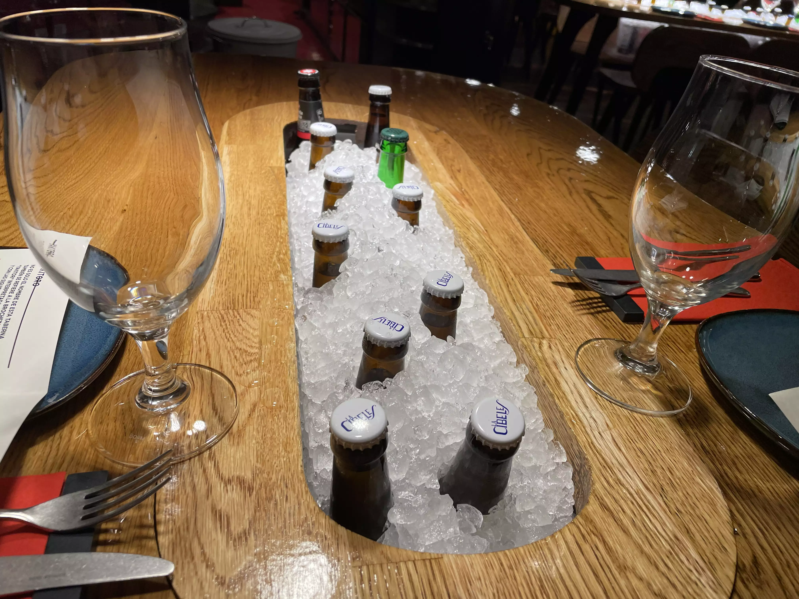
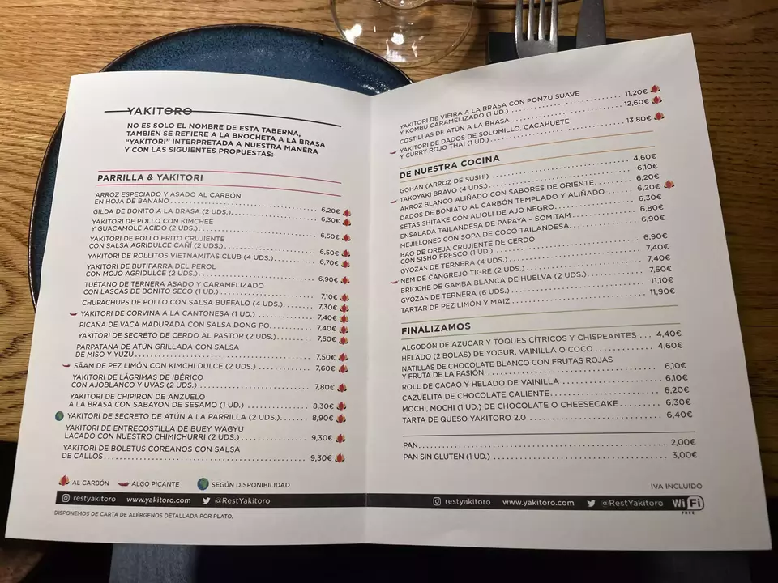
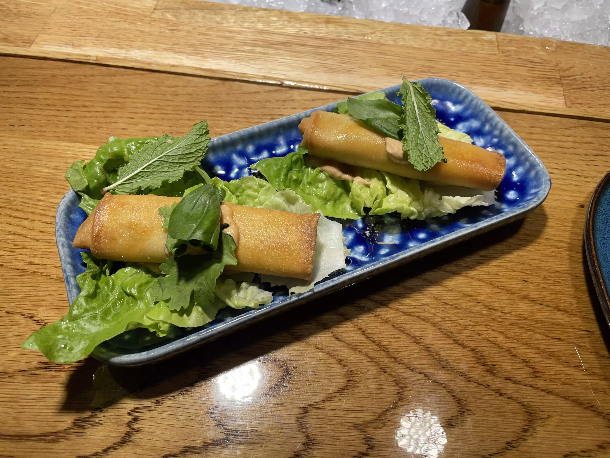
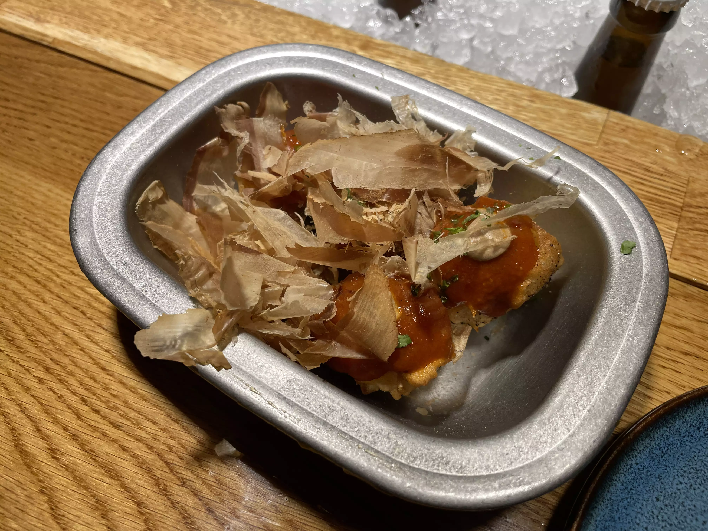
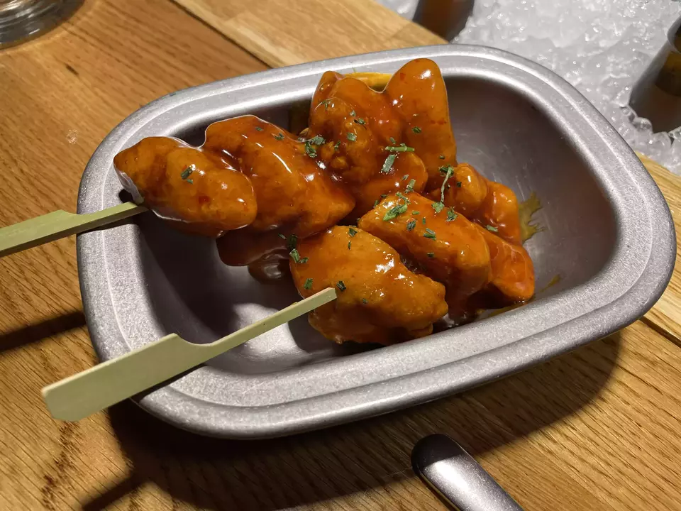
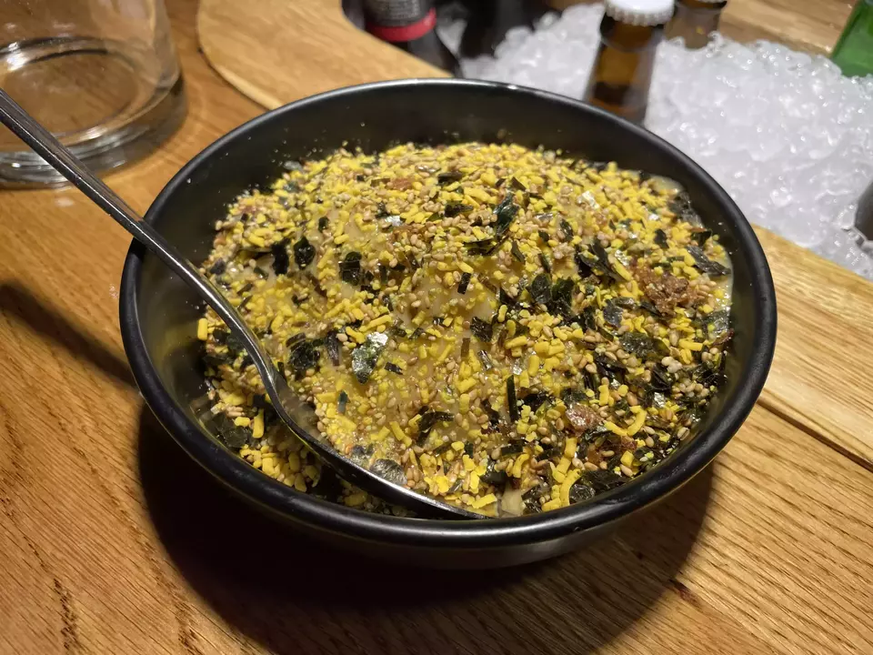
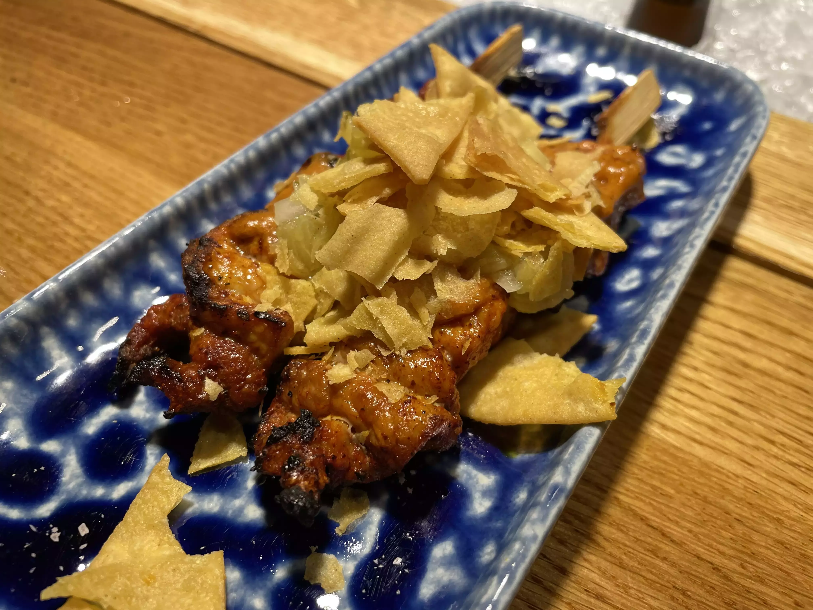
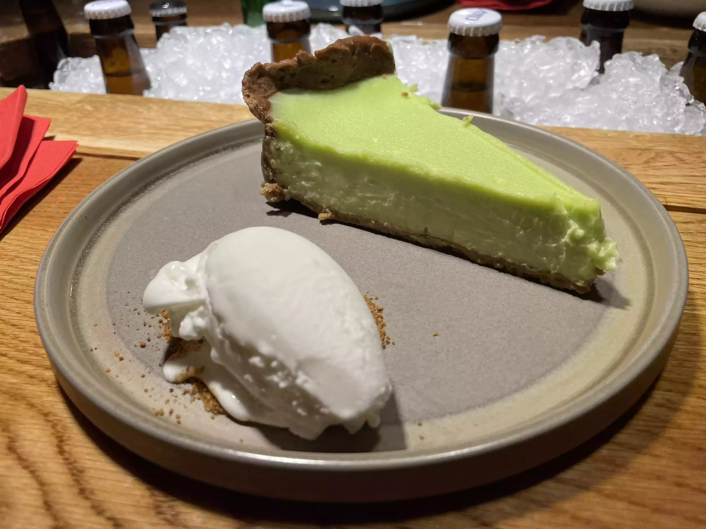
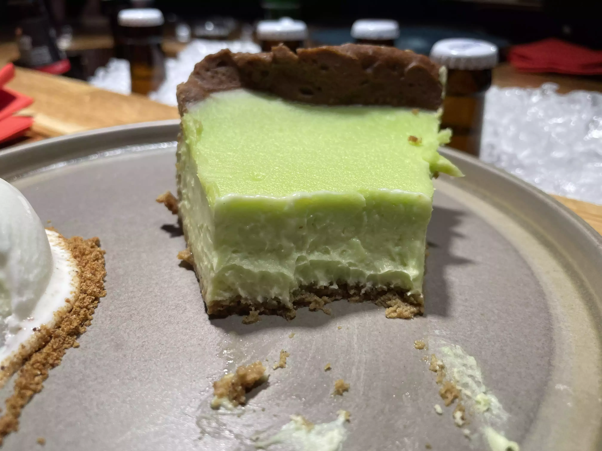
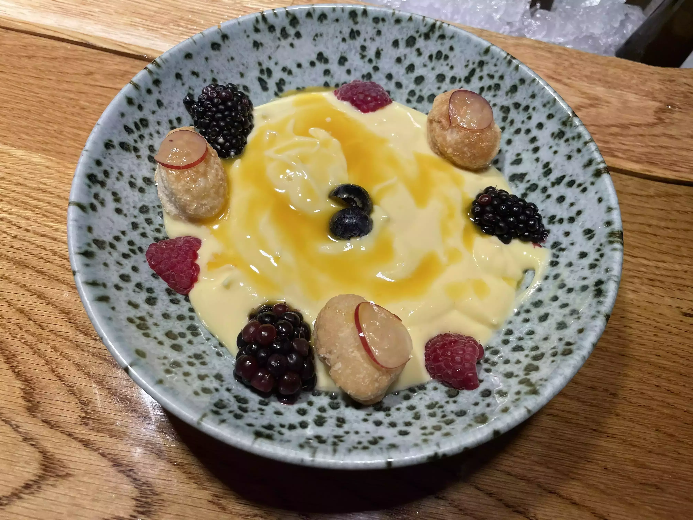

👨‍🍳 Yakitoro Reina @restyakitoro
📍 Calle de la reina 41 #Madrid
💲 Precio: 💲💲
⭐ Valoración: 9
✨ Tras varias recomendaciones de amigos me animé a visitarlo y ¡Qué grata sorpresa!

De primeras te resultará curioso ver como tienes en medio de la mesa cervezas, aunque no puedes cogerlas y tienes que pedirlas a un camarero.

Y la carta a Octubre de 2022 es la que veis:

Para comer pedimos:

- Nem de cangrejo tigre: el entrante más decepcionante, un rollito medio seco y casi sin sabor.

- Takoyaki Bravo: una soberbia interpretación de las bravas. IMPRESCINDIBLES

- Bao de oreja crujiente de cerdo con sisho fresco: si te gusta la oreja es otro imprescindible. Cuando se desmorona en la boca y sale la oreja, os pondrá una lagrimita. Asegurao (Foto de portada de la review)

- Pollo frito crujiente con salsa agridulce cañí: otro plato del cual no me arrepiento.. La salsa aunque no pica tiene sabor a sweett chlli y uff

- Arroz blanco aliñado con sabores de Oriente: el ejemplo de que te recomiendan un arroz, lo pides por pedir y se convierte en el mejor plato de la comida.

- Secreto de cerdo al pastor: muy logrado el sabor de tacos al pastor

 
- Tarta de queso Yakitoro 2.0: una buena tarta de queso, sin carencias y sin lagrimas. Apuesta segura.

- Natillas de chocolate blanco: otro buen postre. Rico sin dudas. Para mi los adornos, sobran, pero insisto, muy rico.

Gratísima sorpresa además del trato del personal, amable, atento. Pides un vaso de agua y te traen una jarra y te la rellenan sin pedirlo. Nivel que no pude no dejarles propina.

Si lo tenéis en la lista de pendientes, de verdad, sacarlo de ahí y disfrutadlo antes que se acabe el mundo. Mis felicitaciones a @luisangelperezchef y su equipo. Grandísimo trabajo.

#asiatic #asiaticofusion #asiaticofusioncañi